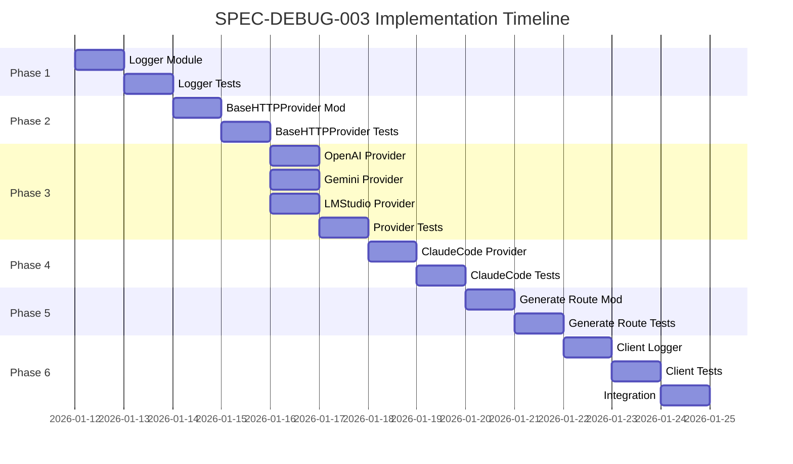

# SPEC-DEBUG-003: Implementation Plan

## Phase 1: Server-side Logger Implementation

### 1.1 Create Logger Module

**File**: `server/utils/llmLogger.ts`

**Tasks**:
- LLMLogEntry 인터페이스 정의
- LLMLogger 클래스 구현
- 요청 ID 생성 함수 구현
- 비동기 로깅 메서드 구현
- 메모리 내 로그 저장소 구현
- 로그 조회 및 삭제 메서드 구현

**Acceptance Criteria**:
- LLMLogger 클래스가 인스턴스화 가능
- logRequest(), logResponse(), logError() 메서드 동작
- getLogs()로 로그 조회 가능
- clearLogs()로 로그 삭제 가능

### 1.2 Logger Unit Tests

**File**: `tests/server/utils/llmLogger.test.ts`

**Tasks**:
- 요청 로깅 테스트
- 응답 로깅 테스트
- 에러 로깅 테스트
- 로그 조회 테스트
- 로그 삭제 테스트
- 스레드 안전성 테스트

**Acceptance Criteria**:
- 모든 테스트 통과
- 코드 커버리지 85% 이상

## Phase 2: BaseHTTPProvider Modification

### 2.1 Integrate Logger into BaseHTTPProvider

**File**: `server/utils/llmProviders/base.ts`

**Tasks**:
- LLMLogger 의존성 주입
- request() 메서드에 로깅 추가
- 요청 시작 시간 기록
- 요청 ID 생성 및 로깅
- 응답 수신 후 로깅
- 에러 발생 시 로깅

**Acceptance Criteria**:
- 모든 HTTP 요청이 로깅됨
- 요청/응답 시간이 정확히 기록됨
- 에러가 올바르게 로깅됨

### 2.2 BaseHTTPProvider Tests

**File**: `tests/server/utils/llmProviders/base.test.ts`

**Tasks**:
- 로거 호출 확인 테스트
- 요청 ID 생성 테스트
- 시간 측정 정확성 테스트
- 에러 로깅 테스트

**Acceptance Criteria**:
- 모든 테스트 통과
- 기존 기능 회귀 없음

## Phase 3: Individual Provider Modification

### 3.1 OpenAI Provider Logging

**File**: `server/utils/llmProviders/openai.ts`

**Tasks**:
- OpenAI 응답 형식 파싱
- 토큰 사용량 추출
- 모델 정보 추출
- BaseHTTPProvider 로거 사용

**Acceptance Criteria**:
- OpenAI 응답에서 토큰 사용량 추출 가능
- 모델 이름이 올바르게 로깅됨

### 3.2 Gemini Provider Logging

**File**: `server/utils/llmProviders/gemini.ts`

**Tasks**:
- Gemini 응답 형식 파싱
- 토큰 사용량 추출
- 모델 정보 추출
- BaseHTTPProvider 로거 사용

**Acceptance Criteria**:
- Gemini 응답에서 토큰 사용량 추출 가능
- 모델 이름이 올바르게 로깅됨

### 3.3 LMStudio Provider Logging

**File**: `server/utils/llmProviders/lmstudio.ts`

**Tasks**:
- LMStudio 응답 형식 파싱
- 토큰 사용량 추출 (지원 시)
- 모델 정보 추출
- BaseHTTPProvider 로거 사용

**Acceptance Criteria**:
- LMStudio 응답 처리 가능
- 모델 이름이 올바르게 로깅됨

### 3.4 Provider Tests

**Files**:
- `tests/server/utils/llmProviders/openai.test.ts`
- `tests/server/utils/llmProviders/gemini.test.ts`
- `tests/server/utils/llmProviders/lmstudio.test.ts`

**Tasks**:
- 각 Provider별 로깅 테스트
- 모의 응답을 사용한 토큰 추출 테스트

**Acceptance Criteria**:
- 모든 테스트 통과
- 기존 기능 회귀 없음

## Phase 4: ClaudeCodeProvider Modification

### 4.1 ClaudeCodeProvider Logging

**File**: `server/utils/llmProviders/claudeCode.ts`

**Tasks**:
- ClaudeCodeProvider 특별 처리
- 실행 결과 로깅
- 도구 사용 정보 로깅
- BaseHTTPProvider와 통합

**Acceptance Criteria**:
- Claude Code 실행 결과가 로깅됨
- 사용된 도구 정보가 기록됨

### 4.2 ClaudeCodeProvider Tests

**File**: `tests/server/utils/llmProviders/claudeCode.test.ts`

**Tasks**:
- ClaudeCodeProvider 로깅 테스트
- 도구 사용 정보 로깅 테스트

**Acceptance Criteria**:
- 모든 테스트 통과

## Phase 5: API Response Format Change

### 5.1 Modify Generate Route

**File**: `server/routes/generate.ts`

**Tasks**:
- LLMLogger에서 로그 조회
- 응답 객체에 디버그 정보 추가
- 최신 LLM 호출 정보 선택
- 디버그 모드 확인 로직

**Acceptance Criteria**:
- API 응답에 llm.debug 객체 포함
- 디버그 모드 비활성화 시 미포함

### 5.2 Generate Route Tests

**File**: `tests/server/routes/generate.test.ts`

**Tasks**:
- 디버그 정보 포함 테스트
- 디버그 모드 비활성화 테스트
- 여러 LLM 호출 테스트

**Acceptance Criteria**:
- 모든 테스트 통과

## Phase 6: Client-side Handling

### 6.1 Create Client Logger Utility

**File**: `src/utils/llmClientLogger.ts`

**Tasks**:
- API 응답에서 디버그 정보 추출 함수
- DebugStore 업데이트 함수
- 토큰 사용량 포맷팅 함수
- 비용 계산 함수

**Acceptance Criteria**:
- 디버그 정보 추출 가능
- DebugStore에 정보 전달 가능

### 6.2 Client Logger Tests

**File**: `tests/utils/llmClientLogger.test.ts`

**Tasks**:
- 디버그 정보 추출 테스트
- 포맷팅 테스트
- 비용 계산 테스트

**Acceptance Criteria**:
- 모든 테스트 통과

### 6.3 Integration with Existing Components

**Files**:
- `src/components/kanban/KanbanCard.tsx` (이미 generate.ts 사용 중)
- 기타 LLM API를 호출하는 컴포넌트

**Tasks**:
- 기존 API 호출 코드와 통합
- 디버그 정보 처리 추가

**Acceptance Criteria**:
- 기존 기능 회귀 없음
- Debug Console에 LLM 정보 표시

## Implementation Order

## Risk Mitigation

| Risk | Probability | Impact | Mitigation |
|------|-------------|--------|------------|
| 기존 Provider 코드 호환성 문제 | 중간 | 높음 | 철저한 회귀 테스트 수행 |
| 로깅으로 인한 성능 저하 | 낮음 | 중간 | 비동기 로깅 구현 |
| API 키 노출 가능성 | 낮음 | 높음 | API 키 마스킹 처리 검증 |
| 메모리 누수 | 낮음 | 중간 | 로그 순환 및 크기 제한 구현 |

## Dependencies

### Prerequisite
- SPEC-DEBUG-001 (Debug Console) 완료
- debugStore 구현 완료

### Blocking
- 없음

## Definition of Done

- [ ] 모든 Phase가 완료됨
- [ ] 모든 단위 테스트 통과 (커버리지 85% 이상)
- [ ] 모든 통합 테스트 통과
- [ ] Debug Console에 LLM 정보 표시됨
- [ ] API 키가 로그에 노출되지 않음
- [ ] 성능 오버헤드 < 10ms
- [ ] 코드 리뷰 완료
- [ ] 문서 업데이트 완료
