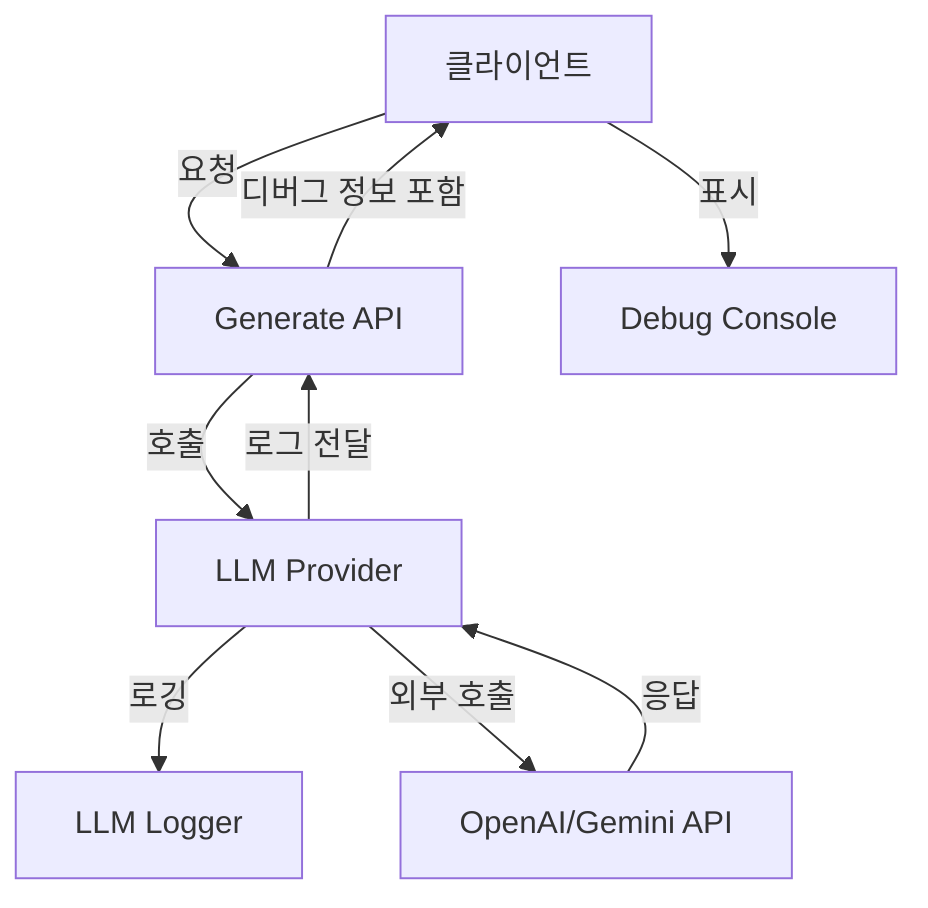

# SPEC-DEBUG-003: LLM Logger API Integration

## Overview

**Description**: LLM API 호출 시 디버깅 정보를 수집하고 Debug Console에 표시하는 서버 사이드 로거 통합 기능

**Purpose**: 현재 Debug Console에 LLM 관련 정보가 표시되지 않는 문제를 해결하여, 사용자가 LLM API 호출의 세부 정보를 실시간으로 모니터링할 수 있도록 함

**Scope**: 서버 사이드 LLM Provider 로거 구현, BaseHTTPProvider 수정, 개별 Provider 통합, ClaudeCodeProvider 지원, API 응답 형식 변경, 클라이언트 핸들링

## Background

### Current State

Debug Console이 구현되었으나 LLM 관련 정보가 표시되지 않음:
- `llmLogger.ts` 파일이 존재하지만 실제 LLM API 호출과 연동되지 않음
- `BaseHTTPProvider`에서 로깅이 수행되지 않음
- 개별 Provider (OpenAI, Gemini, LMStudio, ClaudeCode)에 로깅이 없음
- 서버 로그가 클라이언트로 전달되지 않음

### Problem Statement

사용자가 다음 정보를 확인할 수 없음:
- 사용된 LLM Provider 이름
- 사용된 모델 이름
- 토큰 사용량 (입력/출력/총계)
- 추정 비용
- API 요청/응답 시간

### Solution Approach

1. 서버 사이드 로거 모듈 구현
2. BaseHTTPProvider에 로깅 통합
3. 개별 Provider별 로깅 추가
4. ClaudeCodeProvider 특별 처리
5. API 응답에 디버그 정보 포함
6. 클라이언트에서 디버그 정보 추출 및 표시

## Requirements (EARS Format)

### Ubiquitous Requirements (항상 적용)

**REQ-INT-001**: 시스템은 모든 LLM API 호출에 대한 서버 사이드 로거를 제공해야 한다.

**REQ-INT-002**: 모든 LLM Provider (OpenAI, Gemini, LMStudio, ClaudeCode)는 API 요청, 응답, 에러를 로깅해야 한다.

**REQ-INT-003**: 로거는 스레드 안전(Thread-safe)하게 구현되어야 한다.

**REQ-INT-004**: 로그는 제공된 Provider 이름, 모델 이름, 요청 ID를 포함해야 한다.

### Event-Driven Requirements (이벤트 발생 시 수행)

**REQ-INT-005**: API 응답이 수신되면, 토큰 사용량(prompt_tokens, completion_tokens, total_tokens)을 추출해야 한다.

**REQ-INT-006**: API 요청이 생성되면, Provider 이름과 모델 정보를 로깅해야 한다.

**REQ-INT-007**: API 호출이 실패하면, 에러 메시지와 상태 코드를 로깅해야 한다.

**REQ-INT-008**: 서버 사이드 로깅이 완료되면, 로그 데이터를 클라이언트로 전송해야 한다.

**REQ-INT-009**: 클라이언트가 응답을 수신하면, 디버그 정보를 추출하여 Debug Console에 표시해야 한다.

### State-Driven Requirements (상태에 따른 수행)

**REQ-INT-010**: 디버그 모드가 활성화된 상태에서는, 상세한 로그 정보를 포함해야 한다.

**REQ-INT-011**: 디버그 모드가 비활성화된 상태에서는, 최소한의 필수 정보만 로깅해야 한다.

### Unwanted Requirements (금지 사항)

**REQ-INT-012**: 시스템은 로그에 원시 API 키를 포함해서는 안 된다.

**REQ-INT-013**: 로거는 API 호출 성능에 영향을 주어서는 안 된다 (비동기 처리).

**REQ-INT-014**: 민감한 사용자 데이터는 로그에 포함해서는 안 된다.

### Optional Requirements (선택 사항)

**REQ-INT-015**: 가능한 경우, 토큰 사용량을 기반으로 비용을 추정해야 한다.

**REQ-INT-016**: 로그를 파일 시스템에 영구 저장하는 기능을 제공할 수 있다.

## Technical Specification

### Architecture



### Component Design

#### 1. Server-side Logger (`server/utils/llmLogger.ts`)

```typescript
interface LLMLogEntry {
  id: string
  timestamp: string
  provider: string
  model: string
  request?: {
    prompt?: string
    parameters?: Record<string, unknown>
  }
  response?: {
    content?: string
    usage?: {
      prompt_tokens: number
      completion_tokens: number
      total_tokens: number
    }
    finish_reason?: string
  }
  error?: {
    message: string
    code?: string
  }
  metrics?: {
    duration_ms: number
    estimated_cost?: number
  }
}

interface LLMLogger {
  logRequest(entry: Partial<LLMLogEntry>): void
  logResponse(entry: Partial<LLMLogEntry>): void
  logError(entry: Partial<LLMLogEntry>): void
  getLogs(): LLMLogEntry[]
  clearLogs(): void
}
```

#### 2. BaseHTTPProvider Modification

기존 `request()` 메서드에 로깅 통합:

```typescript
// 요청 전 로깅
this.logger.logRequest({
  id: requestId,
  provider: this.providerName,
  model: options.model
})

// 응답 후 로깅
this.logger.logResponse({
  id: requestId,
  usage: response.usage,
  duration_ms: endTime - startTime
})
```

#### 3. API Response Format

```typescript
interface GenerateResponse {
  content: string
  debug?: {
    llm?: {
      provider: string
      model: string
      tokens: {
        prompt: number
        completion: number
        total: number
      }
      cost?: number
      duration_ms: number
    }
  }
}
```

### File Modifications

| 파일 | 작업 | 설명 |
|------|------|------|
| `server/utils/llmLogger.ts` | 생성 | 서버 사이드 로거 모듈 |
| `server/utils/llmProviders/base.ts` | 수정 | BaseHTTPProvider에 로깅 통합 |
| `server/utils/llmProviders/openai.ts` | 수정 | OpenAI Provider 로깅 |
| `server/utils/llmProviders/gemini.ts` | 수정 | Gemini Provider 로깅 |
| `server/utils/llmProviders/lmstudio.ts` | 수정 | LMStudio Provider 로깅 |
| `server/utils/llmProviders/claudeCode.ts` | 수정 | ClaudeCode Provider 로깅 |
| `server/routes/generate.ts` | 수정 | 응답에 디버그 정보 포함 |
| `src/utils/llmClientLogger.ts` | 생성 | 클라이언트 디버그 정보 추출 |

## Security Considerations

1. **API Key 보호**: 로그에 원시 API 키 포함 금지
2. **민감 정보 필터링**: 사용자 프롬프트에서 개인 식별 정보 제거
3. **접근 제어**: 디버그 정보는 인증된 사용자만 접근 가능

## Performance Considerations

1. **비동기 로깅**: 메인 스레드 차단 방지
2. **로그 크기 제한**: 메모리 사용량 제어
3. **로그 순환**: 오래된 로그 자동 삭제

## Dependencies

### Internal
- `server/utils/llmProviders/base.ts` - BaseHTTPProvider
- `server/routes/generate.ts` - Generate API route
- `src/store/debugStore.ts` - Debug state management

### External
- 없음 (순수 TypeScript 구현)

## Success Criteria

1. 모든 LLM API 호출이 로깅됨
2. Debug Console에 실시간 LLM 정보 표시
3. API 키가 로그에 노출되지 않음
4. API 응답 시간에 영향을 주지 않음 (<10ms 오버헤드)
5. 토큰 사용량 및 비용 정확히 계산됨
