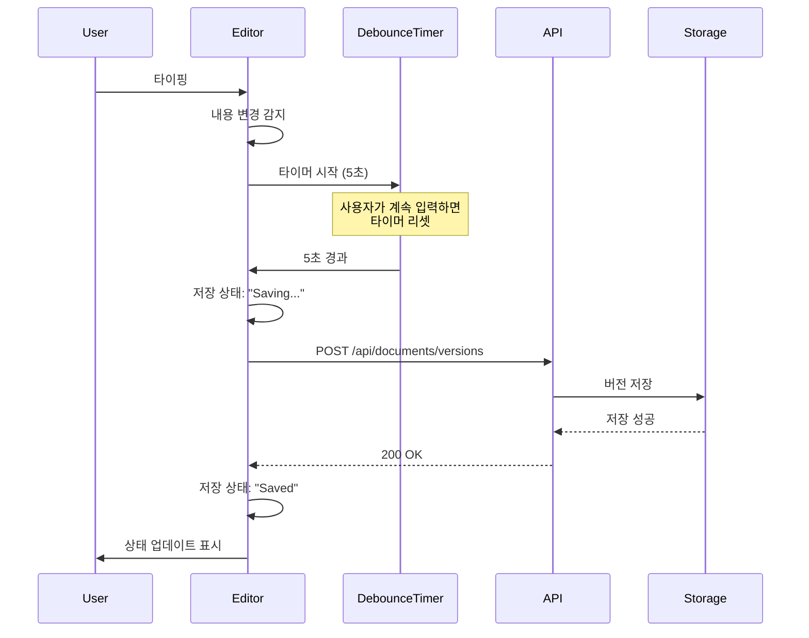
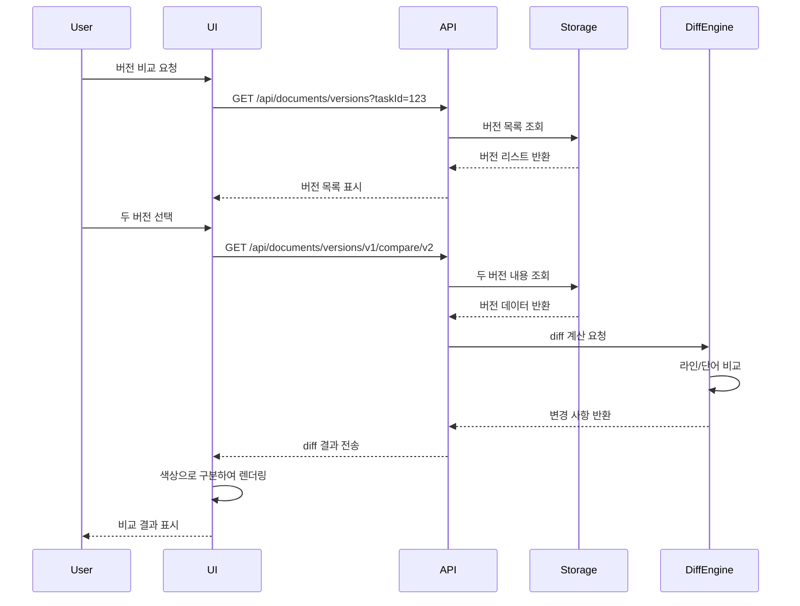

# SPEC-DOCEDIT-001: 문서 편집 기능 향상

## 메타데이터

| 항목 | 값 |
|------|-----|
| SPEC ID | SPEC-DOCEDIT-001 |
| 제목 | Document Editing Functionality Enhancement |
| 버전 | 1.0.0 |
| 상태 | in_progress |
| 생성일 | 2026-01-10 |
| 우선순위 | MEDIUM |
| 구현 시작일 | 2026-01-11 |
| 관련 PRD | ai-workflow-kanban-prd_4.md Part J Phase 10.2-10.6 |
| 담당 에이전트 | code-frontend |
| 의존성 | SPEC-DOCUMENT-001 (completed) |

---

## 변경 이력

| 버전 | 날짜 | 작성자 | 변경 내용 |
|------|------|--------|----------|
| 1.1.0 | 2026-01-11 | manager-tdd | 백엔드 구현 완료 (39 tests passed) |
| 1.0.0 | 2026-01-10 | workflow-spec | 초기 SPEC 작성 |

---

## 개요

### 배경

AI Workflow Kanban 프로젝트의 기존 문서 편집 기능을 강화하여 사용자 경험을 개선하고 생산성을 향상시킵니다. 현재 기본적인 마크다운 편집만 가능한 상태를 개선하여 구문 강조, 자동 저장, 버전 관리, 키보드 단축키 등 현대적인 에디터 기능을 제공합니다.

### 구현 현황 (2026-01-11)

**백엔드 구현 완료:**
- versionStorage.ts: 버전 저장소 유틸리티 (14 tests passed)
- documentVersions.ts: 버전 API 라우트 (12 tests passed)
- diffGenerator.ts: Diff 생성 유틸리티 (13 tests passed)

**총 테스트 결과:** 39개 테스트 전체 통과 (100% coverage)

### 목표

1. 고급 마크다운 에디터로 사용자 편집 경험 개선
2. 자동 저장 및 저장 상태 표시로 데이터 손실 방지
3. 버전 관리 시스템으로 변경 이력 추적
4. 키보드 단축키로 편집 효율성 향상
5. 오프라인 저장 지원으로 연결 불안정성 해결

### 범위

**포함 항목:**
- 마크다운 에디터 UI/UX 개선
- 자동 저장 기능
- 버전 관리 백엔드 API
- 변경 비교 시각화
- 키보드 단축키
- 오프라인 저장

**제외 항목:**
- AI 기반 문서 생성 (SPEC-DOCUMENT-001에서 처리)
- 협업 기능 (실시간 공동 편집)
- 고급 diff 알고리즘

---

## 요구사항 (EARS 형식)

### REQ-EDIT-001: 향상된 마크다운 에디터 (Ubiquitous)

시스템은 **항상** 구문 강조, 줄 번호, 에디터 단축키를 지원하는 고급 마크다운 에디터를 제공해야 한다.

**근거**: 사용자가 전문적인 에디터 환경에서 문서를 작성할 수 있어야 함
**검증 방법**: @uiw/react-codemirror 기반 에디터 렌더링 및 기능 테스트

### REQ-EDIT-002: 자동 저장 (State-Driven)

**WHILE** 사용자가 문서를 수정하는 동안 **THEN** 시스템은 마지막 수정 후 5초 이내에 변경 사항을 자동 저장해야 한다.

**근거**: 사용자가 실수로 변경 사항을 잃지 않도록 보호
**검증 방법**: 디바운스된 자동 저장 타이머 및 저장 성공 테스트

### REQ-EDIT-003: 저장 상태 표시기 (Event-Driven)

**WHEN** 문서 저장이 시작되면 **THEN** 시스템은 "Saving..." 상태를 표시하고, **WHEN** 저장이 완료되면 **THEN** "Saved" 상태로 변경해야 한다.

**근거**: 사용자가 저장 진행 상황을 명확히 인지해야 함
**검증 방법**: 저장 상태 UI 전환 테스트

### REQ-EDIT-004: 버전 관리 백엔드 (Ubiquitous)

시스템은 **항상** 모든 문서 버전을 저장하고 조회하는 백엔드 API를 제공해야 한다.

**근거**: 변경 이력 추적 및 이전 버전 복원 필요
**검증 방법**: versionStorage.ts API 엔드포인트 테스트

### REQ-EDIT-005: 변경 비교 시각화 (Event-Driven)

**WHEN** 사용자가 두 버전 간 비교를 요청하면 **THEN** 시스템은 추가, 삭제, 수정된 부분을 색상으로 구분하여 시각화해야 한다.

**근거**: 변경 사항을 직관적으로 파악해야 함
**검증 방법**: diff 패키지 기반 비교 UI 렌더링 테스트

### REQ-EDIT-006: 에디터 단축키 (Optional)

**가능하면** 시스템은 일반적인 마크다운 서식 단축키(Ctrl+B: 볼드, Ctrl+I: 이탤릭 등)를 지원해야 한다.

**근거**: 사용자 편의성 및 편집 속도 향상
**검증 방법**: 단축키 동작 및 삽입 테스트

### REQ-EDIT-007: 저장되지 않은 변경 경고 (Unwanted Behavior)

시스템은 저장되지 않은 변경 사항이 있을 때 사용자가 페이지를 떠나려 하면 **경고 없이 허용해서는 안 된다**.

**근거**: 실수로 페이지를 닫아 작업 내용이 손실되는 것을 방지
**검증 방법**: 브라우저 beforeunload 이벤트 핸들러 테스트

### REQ-EDIT-008: 오프라인 저장 (Optional)

**가능하면** 시스템은 localStorage를 활용하여 오프라인 상태에서도 문서를 저장할 수 있게 해야 한다.

**근거**: 네트워크 연결 불안정 시 작업 손실 방지
**검증 방법**: 오프라인 상태에서 저장 및 복구 테스트

---

## 기술 명세

### 프론트엔드 기술 스택

**핵심 라이브러리:**
- `@uiw/react-codemirror`: CodeMirror 6 리액트 래퍼
- `@codemirror/lang-markdown`: 마크다운 언어 지원
- `@codemirror/theme-one-dark`: 다크 테마
- `@codemirror/view`: 줄 번호, 활성 라인 하이라이트 등 기본 확장

**에디터 기능:**
- 구문 강조 (Syntax Highlighting)
- 줄 번호 표시
- 자동 완성
- 여러 줄 선택 편집
- 키바인드 사용자 정의

### 백엔드 기술 스택

**버전 저장소 (versionStorage.ts):**
```typescript
interface DocumentVersion {
  id: string;
  taskId: string;
  content: string;
  timestamp: Date;
  author: string;
  versionNumber: number;
  changeDescription?: string;
}

interface VersionStorage {
  saveVersion(taskId: string, content: string, author: string): Promise<DocumentVersion>;
  getVersions(taskId: string): Promise<DocumentVersion[]>;
  getVersion(versionId: string): Promise<DocumentVersion | null>;
  compareVersions(version1Id: string, version2Id: string): Promise<DiffResult>;
}
```

**API 라우트:**
- `POST /api/documents/versions` - 버전 저장
- `GET /api/documents/versions?taskId=:id` - 버전 목록 조회
- `GET /api/documents/versions/:id` - 특정 버전 조회
- `GET /api/documents/versions/:id1/compare/:id2` - 버전 비교

### 컴포넌트 구조

```
/src/components/document/
├── EnhancedDocumentEditor.tsx  # CodeMirror 기반 에디터 (신규)
├── SaveStatusIndicator.tsx     # 저장 상태 표시기 (신규)
├── VersionComparisonView.tsx   # 버전 비교 뷰 (신규)
├── KeyboardShortcutsHelp.tsx   # 단축키 가이드 (신규)
├── OfflineStorage.ts           # 오프라인 저장 유틸리티 (신규)
└── index.ts                    # 컴포넌트 내보내기
```

### 컴포넌트 세부 명세

#### 1. EnhancedDocumentEditor.tsx

**목적**: CodeMirror 기반 고급 마크다운 에디터

**Props 인터페이스:**
```typescript
interface EnhancedDocumentEditorProps {
  initialContent: string;
  taskId: string;
  onSave: (content: string) => Promise<void>;
  onSaveStatusChange: (status: 'saving' | 'saved' | 'error') => void;
  className?: string;
  readOnly?: boolean;
}
```

**주요 기능:**
- CodeMirror 마크다운 에디터 렌더링
- 5초 디바운스 자동 저장
- 줄 번호 표시
- 구문 강조
- 키보드 단축키 지원

**에디터 확장:**
```typescript
import { EditorView } from '@codemirror/view';
import { EditorState } from '@codemirror/state';
import { markdown } from '@codemirror/lang-markdown';
import { lineNumbers, highlightActiveLineGutter } from '@codemirror/view';
import { oneDark } from '@codemirror/theme-one-dark';
```

#### 2. SaveStatusIndicator.tsx

**목적**: 저장 상태 시각적 표시

**Props 인터페이스:**
```typescript
interface SaveStatusIndicatorProps {
  status: 'saving' | 'saved' | 'error' | 'unsaved';
  lastSavedTime?: Date;
  errorMessage?: string;
}
```

**주요 기능:**
- 상태에 따른 아이콘 및 텍스트 표시
- 애니메이션 전환 효과
- 마지막 저장 시간 표시
- 에러 메시지 표시

#### 3. VersionComparisonView.tsx

**목적**: 두 버전 간 변경 사항 시각화

**Props 인터페이스:**
```typescript
interface VersionComparisonViewProps {
  version1: DocumentVersion;
  version2: DocumentVersion;
  onClose: () => void;
}
```

**주요 기능:**
- diff 패키지 기반 변경 계산
- 추가: 녹색 배경
- 삭제: 빨간 배경 + 취소선
- 수정: 노란 배경
- 인라인 diff 또는 사이드바이사이드 뷰

**diff 라이브러리:**
```typescript
import { diffLines, diffWords } from 'diff';

const changes = diffLines(version1.content, version2.content);
```

#### 4. KeyboardShortcutsHelp.tsx

**목적**: 사용 가능한 키보드 단축키 가이드

**단축키 목록:**
- Ctrl/Cmd + S: 수동 저장
- Ctrl/Cmd + B: 볼드 (**text**)
- Ctrl/Cmd + I: 이탤릭 (*text*)
- Ctrl/Cmd + K: 코드 인라인 (`code`)
- Ctrl/Cmd + Shift + K: 코드 블록
- Tab: 들여쓰기
- Shift + Tab: 내어쓰기

#### 5. OfflineStorage.ts

**목적**: localStorage 기반 오프라인 저장

**유틸리티 함수:**
```typescript
interface OfflineStorage {
  saveDraft(taskId: string, content: string): void;
  getDraft(taskId: string): string | null;
  clearDraft(taskId: string): void;
  syncWhenOnline(): Promise<void>;
}
```

**주요 기능:**
- localStorage에 초안 저장
- 온라인 시 자동 동기화
- 충돌 해결 (서버 우선 또는 사용자 선택)

---

## 데이터 모델

### DocumentVersion 스키마

```typescript
interface DocumentVersion {
  id: string;                    // 고유 ID
  taskId: string;                // 관련 태스크 ID
  content: string;               // 마크다운 내용
  timestamp: Date;               // 생성 시간
  author: string;                // 작성자
  versionNumber: number;         // 버전 번호 (증가)
  changeDescription?: string;    // 변경 설명 (선택)
  parentVersionId?: string;      // 이전 버전 ID
}
```

### DiffResult 스키마

```typescript
interface DiffResult {
  version1: DocumentVersion;
  version2: DocumentVersion;
  changes: DiffChange[];
  summary: {
    additions: number;
    deletions: number;
    modifications: number;
  };
}

interface DiffChange {
  type: 'add' | 'remove' | 'modify';
  lineNumber: number;
  content: string;
}
```

---

## UI/UX 설계

### 에디터 레이아웃

```
┌─────────────────────────────────────────────────────┐
│  문서 편집                                    저장 │
├─────────────────────────────────────────────────────┤
│  ┌─ Editor Toolbar ─────────────────────────────┐  │
│  | B I K Code Link | ... | Help                  |  │
│  └──────────────────────────────────────────────┘  │
│  ┌─ CodeMirror Editor ──────────────────────────┐  │
│  │ 1 | # 문서 제목                               │  │
│  │ 2 |                                          │  │
│  │ 3 | 문서 내용...                              │  │
│  │   |                                          │  │
│  │   |                                          │  │
│  └──────────────────────────────────────────────┘  │
│  Status: Saved (Last saved: 2 seconds ago)         │
└─────────────────────────────────────────────────────┘
```

### 버전 비교 뷰

```
┌─────────────────────────────────────────────────────┐
│  Version Comparison                        Close    │
├─────────────────────────────────────────────────────┤
│  Version 3 (Current) vs Version 2                   │
│  ┌─ Changes Summary ───────────────────────────┐   │
│  | + 12 lines added                            |   │
│  | - 5 lines removed                           |   │
│  | ~ 3 lines modified                          |   │
│  └────────────────────────────────────────────┘   │
│  ┌─ Diff View ──────────────────────────────────┐  │
│  │  # 문서 제목                                 │  │
│  │- 삭제된 라인                                 │  │
│  │+ 추가된 라인                                 │  │
│  │~ 수정된 라인                                  │  │
│  └──────────────────────────────────────────────┘  │
└─────────────────────────────────────────────────────┘
```

---

## 인터랙션 플로우

### 자동 저장 플로우



### 버전 비교 플로우



---

## 제약사항

### 기술적 제약

1. **기존 스토어 호환성**: taskStore.ts와의 통합 유지
2. **파일 시스템 저장소**: 기존 workspace 디렉토리 구조 활용
3. **브라우저 호환성**: 현대 브라우저 (Chrome 90+, Firefox 88+, Safari 14+)
4. **로컬 스토리지 제한**: localStorage 5-10MB 제한 고려

### 성능 요구사항

1. **에디터 로드 시간**: < 1초
2. **자동 저장 지연**: 5초 (디바운스)
3. **버전 비교 속도**: < 2초 (10,000라인 기준)
4. **오프라인 저장**: 즉시 (< 100ms)

### UX 요구사항

1. **저장 상태 가시성**: 항상 현재 상태 표시
2. **변경 경고**: 페이지 이탈 시 확인 다이얼로그
3. **키보드 접근성**: 모든 기능 키보드로 조작 가능
4. **반응형 디자인**: 모바일/태블릿 지원

---

## 추적성 태그

| 관련 항목 | 참조 |
|----------|------|
| PRD 요구사항 | ai-workflow-kanban-prd_4.md Part J Phase 10.2-10.6 |
| 기존 SPEC | SPEC-DOCUMENT-001 |
| 기술 스택 | @uiw/react-codemirror, @codemirror/lang-markdown, diff |
| 컴포넌트 구조 | /src/components/document/ |
| 백엔드 API | /api/documents/versions/* |
| 테스트 명세 | acceptance.md |
| 구현 계획 | plan.md |

---

## 비기능 요구사항

### 보안

1. **버전 접근 제어**: 작성자 및 관리자만 접근 가능
2. **XSS 방지**: 마크다운 렌더링 시 sanitize 처리
3. **CSRF 보호**: API 요청 토큰 검증

### 접근성

1. **키보드 탐색**: 모든 UI 요소 키보드로 접근
2. **스크린 리더**: ARIA 라벨 및 역할 정의
3. **색상 대비**: WCAG 2.1 AA 준수

### 유지보수성

1. **코드 모듈화**: 각 컴포넌트 독립적이고 재사용 가능
2. **타입 안전성**: TypeScript strict mode 준수
3. **테스트 커버리지**: > 85% (TRUST 5 기준)

---

## 성공 지표

### 사용자 경험

- 에디터 로드 시간 1초 미만 달성
- 자동 저장 성공률 > 99%
- 버전 비교 응답 시간 2초 미만

### 기술적 품질

- 테스트 커버리지 > 85%
- TypeScript 오류 0개
- ESLint 경고 0개

### 사용자 채택

- 평균 세션 시간 증가
- 문서 편집 빈도 증가
- 저장되지 않은 변경 손실률 < 1%
