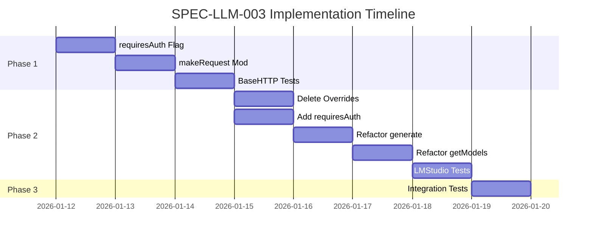

# SPEC-LLM-003: Implementation Plan

## Phase 1: BaseHTTPProvider Modification

### 1.1 Add requiresAuth Flag

**File**: `server/utils/llmProviders/base.ts`

**Tasks**:
- BaseHTTPProvider 클래스에 `protected requiresAuth: boolean = true` 속성 추가
- ProviderConfig 인터페이스에 `requiresAuth?: boolean` 옵션 추가
- constructor에서 requiresAuth 초기화 로직 추가

**Acceptance Criteria**:
- requiresAuth 속성이 기본값 true로 설정됨
- config.requiresAuth로 값을 덮어쓸 수 있음

### 1.2 Modify makeRequest() Method

**File**: `server/utils/llmProviders/base.ts`

**Tasks**:
- makeRequest() 메서드의 headers 설정 수정
- requiresAuth가 true일 때만 Authorization 헤더 추가

**코드 변경**:
```typescript
headers: {
  'Content-Type': 'application/json',
  ...(this.requiresAuth && { 'Authorization': `Bearer ${this.apiKey}` }),
},
```

**Acceptance Criteria**:
- requiresAuth=true일 때 Authorization 헤더 포함
- requiresAuth=false일 때 Authorization 헤더 미포함

### 1.3 Unit Tests

**File**: `tests/server/utils/llmProviders/base.test.ts` (새로 생성)

**Tasks**:
- requiresAuth 기본값 테스트
- requiresAuth=false 설정 테스트
- makeRequest() Authorization 헤더 포함/미포함 테스트

**Acceptance Criteria**:
- 모든 테스트 통과
- 기존 기능 회귀 없음

## Phase 2: LMStudioProvider Refactoring

### 2.1 Delete testConnection() Override

**File**: `server/utils/llmProviders/lmstudio.ts`

**Tasks**:
- testConnection() 메서드 전체 삭제 (95-141줄)

**Acceptance Criteria**:
- testConnection() 메서드가 존재하지 않음
- 기본 클래스의 testConnection(projectId?)가 사용됨

### 2.2 Delete makeLocalRequest() Method

**File**: `server/utils/llmProviders/lmstudio.ts`

**Tasks**:
- makeLocalRequest() 메서드 전체 삭제 (156-251줄)

**Acceptance Criteria**:
- makeLocalRequest() 메서드가 존재하지 않음

### 2.3 Add requiresAuth Property

**File**: `server/utils/llmProviders/lmstudio.ts`

**Tasks**:
- 클래스에 `protected requiresAuth = false` 속성 추가

**Acceptance Criteria**:
- requiresAuth가 false로 설정됨
- Authorization 헤더가 전송되지 않음

### 2.4 Refactor generate() Method

**File**: `server/utils/llmProviders/lmstudio.ts`

**Tasks**:
- makeLocalRequest() 호출을 makeRequest()로 변경
- 로깅 로직은 기본 클래스에 위임

**Acceptance Criteria**:
- generate()가 기본 클래스의 makeRequest() 사용
- 로깅이 정상 작동

### 2.5 Refactor getAvailableModels() Method

**File**: `server/utils/llmProviders/lmstudio.ts`

**Tasks**:
- testConnection() 호출 제거
- /models 엔드포인트 직접 호출로 재구현
- 에러 발생 시 빈 배열 반환

**코드**:
```typescript
async getAvailableModels(): Promise<string[]> {
  try {
    const controller = new AbortController();
    const timeoutId = setTimeout(() => controller.abort(), 5000);

    const response = await fetch(`${this.endpoint}/models`, {
      method: 'GET',
      signal: controller.signal,
    });

    clearTimeout(timeoutId);

    if (!response.ok) {
      return [];
    }

    const data = await response.json() as LMStudioModelsResponse;
    return data.data?.map(m => m.id) || [];
  } catch {
    return [];
  }
}
```

**Acceptance Criteria**:
- /models 엔드포인트 직접 호출
- 타임아웃 5초 적용
- 에러 시 빈 배열 반환

### 2.6 LMStudioProvider Tests

**File**: `tests/server/utils/llmProviders/lmstudio.test.ts` (새로 생성)

**Tasks**:
- getAvailableModels() 정상 응답 테스트
- getAvailableModels() 타임아웃 테스트
- getAvailableModels() 에러 응답 테스트
- generate() Authorization 헤더 미포함 테스트
- requiresAuth=false 확인 테스트

**Acceptance Criteria**:
- 모든 테스트 통과
- 코드 커버리지 80% 이상

## Phase 3: Integration Testing

### 3.1 Connection Test Logging

**Tasks**:
- LM Studio 연결 테스트 실행
- 서버 로그에 연결 테스트 로그 기록 확인
- Debug API (/api/debug/logs/connection-tests)로 로그 조회 확인

**Acceptance Criteria**:
- 연결 테스트 로그가 기록됨
- projectId가 로그에 포함됨
- phase: 'start', 'success' 또는 'failure'가 기록됨

### 3.2 Model List Display

**Tasks**:
- LM Studio 서버 시작
- /api/projects/:projectId/llm-settings/provider/lmstudio/models 호출
- 모델 목록 반환 확인

**Acceptance Criteria**:
- 로드된 모델 목록이 반환됨
- 응답 형식이 다른 프로바이더와 일치

### 3.3 Regression Tests

**Tasks**:
- 기존 LLM 관련 테스트 실행
- LM Studio로 PRD 생성 테스트

**Acceptance Criteria**:
- 모든 기존 테스트 통과
- LM Studio로 PRD 생성 정상 작동

## Implementation Order



## Risk Mitigation

| Risk | Probability | Impact | Mitigation |
|------|-------------|--------|------------|
| 기존 generate() 기능 회귀 | 낮음 | 높음 | 철저한 통합 테스트 수행 |
| LM Studio API 변경 | 낮음 | 중간 | OpenAI-compatible API 표준 준수 |
| 인증 헤더 관련 다른 프로바이더 영향 | 낮음 | 높음 | requiresAuth 기본값 true 유지 |

## Dependencies

### Prerequisite
- BaseHTTPProvider 구현 완료
- SPEC-LLM-002 (연결 테스트 로깅) 완료

### Blocking
- 없음

## Definition of Done

- [ ] Phase 1 완료: BaseHTTPProvider에 requiresAuth 추가
- [ ] Phase 2 완료: LMStudioProvider 리팩토링
- [ ] Phase 3 완료: 통합 테스트 통과
- [ ] 모든 단위 테스트 통과 (커버리지 80% 이상)
- [ ] 모든 통합 테스트 통과
- [ ] LM Studio 모델 목록 표시됨
- [ ] 연결 테스트 로그 기록됨 (SPEC-LLM-002 준수)
- [ ] 기존 기능 회귀 없음
- [ ] 코드 리뷰 완료
