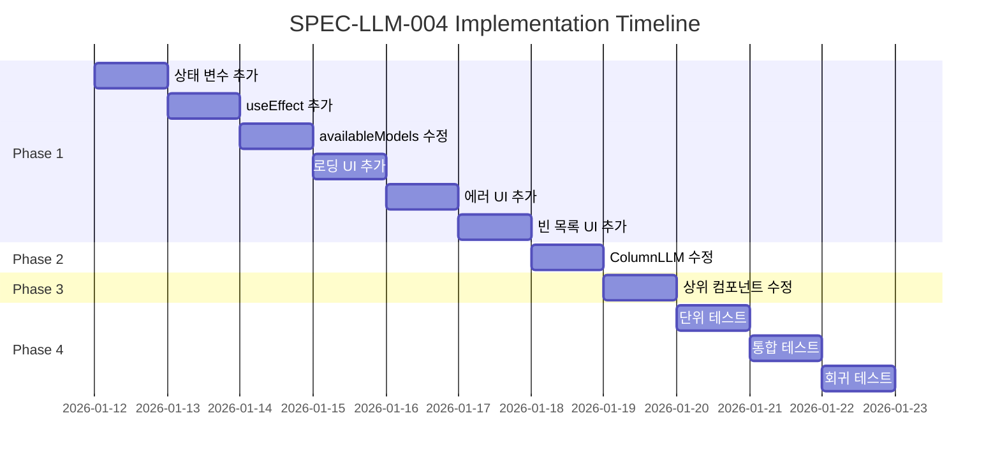

# SPEC-LLM-004: Implementation Plan

## Phase 1: TaskStageModelSelector 수정

### 1.1 상태 변수 추가

**File**: `src/components/llm/TaskStageModelSelector.tsx`

**Tasks**:
- `StageConfigEditor` 컴포넌트에 동적 모델 상태 변수 추가
- 로딩 상태 변수 추가
- 에러 상태 변수 추가

**코드 추가**:
```typescript
interface StageConfigEditorProps {
  // ... 기존 props ...
  projectId?: string; // 추가: 모델 가져오기용
}

function StageConfigEditor({
  // ... 기존 props ...
  projectId,
}: StageConfigEditorProps) {
  // ... 기존 상태 ...

  // 동적 모델 로딩을 위한 상태
  const [dynamicModels, setDynamicModels] = useState<Record<LLMProvider, string[]>>({
    lmstudio: [],
  });
  const [isLoadingModels, setIsLoadingModels] = useState(false);
  const [modelLoadError, setModelLoadError] = useState<string | null>(null);
```

**Acceptance Criteria**:
- 상태 변수가 정의됨
- TypeScript 타입 오류 없음

### 1.2 useEffect 훅 추가

**Tasks**:
- 프로바이더가 LM Studio로 변경될 때 모델 목록 가져오기
- 프로바이더가 다른 것으로 변경되면 캐시 정리

**코드 추가**:
```typescript
useEffect(() => {
  const fetchModelsForProvider = async (provider: LLMProvider, pid: string) => {
    // LM Studio에만 동적 로딩 적용
    if (provider !== 'lmstudio') {
      return;
    }

    setIsLoadingModels(true);
    setModelLoadError(null);

    try {
      const { getProviderModels } = await import('../../services/llmSettingsService');
      const models = await getProviderModels(pid, provider);
      setDynamicModels(prev => ({ ...prev, [provider]: models }));
    } catch (error) {
      setModelLoadError(
        error instanceof Error ? error.message : '모델 목록을 가져오지 못했습니다'
      );
      setDynamicModels(prev => ({ ...prev, [provider]: [] }));
    } finally {
      setIsLoadingModels(false);
    }
  };

  if (localConfig?.provider && projectId) {
    fetchModelsForProvider(localConfig.provider, projectId);
  } else if (localConfig?.provider !== 'lmstudio') {
    // LM Studio가 아니면 에러 상태 정리
    setModelLoadError(null);
  }
}, [localConfig?.provider, projectId]);
```

**Acceptance Criteria**:
- LM Studio 선택 시 API 호출됨
- 다른 프로바이더 선택 시 API 호출 안 됨
- 에러 발생 시 error 상태 설정됨

### 1.3 availableModels 계산 로직 수정

**Tasks**:
- 정적 AVAILABLE_MODELS와 동적 dynamicModels 병합

**코드 수정**:
```typescript
// 기존 코드 (Line 99-101):
// const availableModels = localConfig
//   ? AVAILABLE_MODELS[localConfig.provider] || []
//   : [];

// 수정 후 코드:
const availableModels = localConfig
  ? (localConfig.provider === 'lmstudio'
      ? dynamicModels.lmstudio
      : AVAILABLE_MODELS[localConfig.provider]) || []
  : [];
```

**Acceptance Criteria**:
- LM Studio 선택 시 dynamicModels 사용
- 다른 프로바이더 선택 시 AVAILABLE_MODELS 사용

### 1.4 로딩 UI 추가

**Tasks**:
- 모델 드롭다운 아래에 로딩 스피너 추가

**코드 추가** (모델 드롭다운 아래):
```tsx
{/* 모델 드롭다운 아래 추가 */}
{localConfig?.provider === 'lmstudio' && isLoadingModels && (
  <div className="flex items-center gap-2 mt-1 text-sm text-gray-400">
    <svg className="animate-spin h-4 w-4" viewBox="0 0 24 24">
      <circle
        className="opacity-25"
        cx="12"
        cy="12"
        r="10"
        stroke="currentColor"
        strokeWidth="4"
        fill="none"
      />
      <path
        className="opacity-75"
        fill="currentColor"
        d="M4 12a8 8 0 018-8V0C5.373 0 0 5.373 0 12h4zm2 5.291A7.962 7.962 0 014 12H0c0 3.042 1.135 5.824 3 7.938l3-2.647z"
      />
    </svg>
    <span>모델 목록을 가져오는 중...</span>
  </div>
)}
```

**Acceptance Criteria**:
- 로딩 중 스피너와 텍스트 표시됨
- LM Studio 아닌 프로바이더에서는 표시 안 됨

### 1.5 에러 UI 추가

**Tasks**:
- 모델 가져오기 실패 시 에러 메시지 표시

**코드 추가** (로딩 UI 아래):
```tsx
{localConfig?.provider === 'lmstudio' && modelLoadError && !isLoadingModels && (
  <div className="flex items-center gap-2 mt-1 text-sm text-amber-500">
    <svg className="h-4 w-4" viewBox="0 0 20 20" fill="currentColor">
      <path
        fillRule="evenodd"
        d="M8.257 3.099c.765-1.36 2.722-1.36 3.486 0l5.58 9.92c.75 1.334-.213 2.98-1.742 2.98H4.42c-1.53 0-2.493-1.646-1.743-2.98l5.58-9.92zM11 13a1 1 0 11-2 0 1 1 0 012 0zm-1-8a1 1 0 00-1 1v3a1 1 0 002 0V6a1 1 0 00-1-1z"
        clipRule="evenodd"
      />
    </svg>
    <span>{modelLoadError}</span>
  </div>
)}
```

**Acceptance Criteria**:
- 에러 발생 시 경고 아이콘과 메시지 표시됨
- 로딩 중에는 표시 안 됨

### 1.6 빈 목록 메시지 추가

**Tasks**:
- 모델 목록이 비어있을 때 메시지 표시

**코드 추가**:
```tsx
{localConfig?.provider === 'lmstudio' &&
  !isLoadingModels &&
  !modelLoadError &&
  dynamicModels.lmstudio.length === 0 && (
  <div className="text-sm text-gray-500 mt-1">
    사용 가능한 모델이 없습니다. LM Studio 서버가 실행 중인지 확인하세요.
  </div>
)}
```

**Acceptance Criteria**:
- 빈 목록 시 안내 메시지 표시됨

## Phase 2: ColumnLLMSettingsModal 수정

### 2.1 상태 변수 추가

**File**: `src/components/llm/ColumnLLMSettingsModal.tsx`

**Tasks**:
- TaskStageModelSelector와 동일한 패턴으로 상태 추가
- projectId는 props에서 이미 사용 가능

**Acceptance Criteria**:
- 상태 변수가 정의됨
- TypeScript 타입 오류 없음

### 2.2 useEffect 및 UI 추가

**Tasks**:
- TaskStageModelSelector와 동일한 패턴 적용
- 모달 내 모델 선택 UI에 로딩/에러 상태 추가

**Acceptance Criteria**:
- 모달에서 동일한 동작이 작동함
- UI 일관성 유지됨

## Phase 3: 상위 컴포넌트 수정

### 3.1 projectId prop 전달

**Files**:
- `src/components/llm/TaskStageModelSelector.tsx` 사용처
- `src/components/llm/ColumnLLMSettingsModal.tsx` 사용처

**Tasks**:
- 상위 컴포넌트에서 projectId prop 전달 확인
- 필요한 경우 prop 추가

**Acceptance Criteria**:
- projectId가 자식 컴포넌트로 전달됨
- API 호출에 projectId 사용됨

## Phase 4: 테스트

### 4.1 단위 테스트

**File**: `tests/src/components/llm/TaskStageModelSelector.test.tsx`

**Tests**:
- LM Studio 선택 시 getProviderModels 호출
- 로딩 상태 표시
- 에러 상태 처리
- 다른 프로바이더 선택 시 동적 로딩 안 함

**Acceptance Criteria**:
- 모든 테스트 통과
- 커버리지 80% 이상

### 4.2 통합 테스트

**Tasks**:
- 실제 LM Studio 서버와 연동 테스트
- 모델 목록 표시 확인
- 에러 처리 확인

**Acceptance Criteria**:
- 실제 환경에서 모델 목록 표시됨
- 서버 중지 시 에러 메시지 표시됨

### 4.3 회귀 테스트

**Tasks**:
- 다른 프로바이더(OpenAI, Gemini, Claude Code) 동작 확인
- 기존 기능에 영향 없는지 확인

**Acceptance Criteria**:
- 모든 기존 테스트 통과
- 다른 프로바이더 정상 작동

## Implementation Order



## Risk Mitigation

| Risk | Probability | Impact | Mitigation |
|------|-------------|--------|------------|
| projectId prop 누락 | 중간 | 높음 | 기본값 처리, propTypes 검증 |
| API 호출 실패 시 UI 멈춤 | 낮음 | 높음 | try-catch로 에러 처리 |
| 다른 프로바이더 영향 | 낮음 | 높음 | 조건부 렌더링으로 분리 |
| 불필요한 재요청 | 중간 | 중간 | 의존성 배열 최적화 |

## Dependencies

### Prerequisite
- SPEC-LLM-002: 연결 테스트 로깅 (서버 로그 확인용)
- SPEC-LLM-003: LM Studio 프로바이더 리팩토링 (/models 엔드포인트)

### Blocking
- 없음 (프론트엔드만 수정)

## Definition of Done

- [x] Phase 1 완료: TaskStageModelSelector 동적 모델 로딩
- [x] Phase 2 완료: ColumnLLMSettingsModal 동적 모델 로딩
- [x] Phase 3 완료: 상위 컴포넌트 projectId prop 전달
- [x] Phase 4 완료: 모든 테스트 통과
- [x] LM Studio 선택 시 모델 목록 표시됨
- [x] 로딩 상태 명확히 표시됨
- [x] 에러 처리 적절히 작동함
- [x] 다른 프로바이더 동작에 영향 없음
- [x] 기존 기능 회귀 없음
- [x] 코드 리뷰 완료
