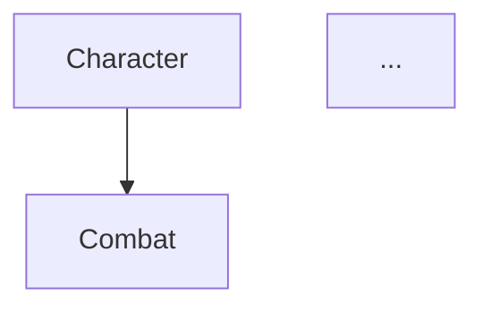

# AI Workflow Kanban PRD

> **버전**: 1.2  
> **작성일**: 2025-12-31  
> **구현 도구**: Claude Code (Headless Mode)

---

## 1. 개요

### 1.1 제품 비전

게임 기획 파이프라인을 칸반 보드 형태로 시각화하고, 각 단계에서 AI(Claude Code)가 자동으로 문서를 생성하는 워크플로우 시스템.

### 1.2 목표

- 기획서 작성 시간 단축
- 피쳐리스트 → 기획서 → PRD → 프로토타입 파이프라인 자동화
- 기존 기획서(Central Dogma)를 기반으로 일관된 문서 생성
- 다중 게임 프로젝트 관리 지원

### 1.3 타겟 사용자

- MMORPG 및 다양한 장르의 시스템 기획자
- Claude Code를 활용하는 게임 개발팀

### 1.4 해결 문제

- 기획서 작성에 소요되는 시간 과다
- 기존 기획서와의 연관성 파악 어려움
- 반복적인 문서 작성 작업
- 여러 게임 프로젝트 간 컨텍스트 분리 필요

### 1.5 용어 정의

| 용어 | 정의 | 예시 |
|------|------|------|
| **프로젝트 (Project)** | 하나의 게임 단위 | Project Alpha, Project Beta |
| **작업 (Task)** | 하나의 기획 작업 단위 (칸반 카드) | "Guardian Star 시스템", "신규 레이드" |
| **시스템 문서 (System Document)** | 해당 게임의 기존 기획서 | Character.md, Combat.md |
| **RootRule** | 프로젝트의 Central Dogma | 시스템 인덱스, 용어 사전, 의존성 그래프 |

---

## 2. 핵심 기능

### 2.1 프로젝트 관리

**설명**: 여러 게임 프로젝트를 분리하여 관리. 각 프로젝트별로 독립적인 시스템 문서와 기술 스택 보유.

**사용자 스토리**: 
> "기획자로서, 나는 여러 게임 프로젝트를 분리하여 각각의 기획서를 관리하고 싶다"

**수락 기준**:
- [ ] 프로젝트 생성 (이름, 설명, 기술 스택, 카테고리 정의)
- [ ] 프로젝트 선택/전환 (헤더 드롭다운)
- [ ] 프로젝트 설정 수정
- [ ] 프로젝트 삭제 (확인 다이얼로그)

### 2.2 시스템 문서 관리 (관련 기획서)

**설명**: 프로젝트별로 기존 기획서(시스템 문서)를 등록하고 카테고리/태그로 분류

**사용자 스토리**: 
> "기획자로서, 나는 기존 기획서를 카테고리와 태그로 분류하여 쉽게 찾고 참조하고 싶다"

**수락 기준**:
- [ ] 시스템 문서 추가 (이름, 카테고리, 태그, 내용, 의존 시스템)
- [ ] 마크다운 에디터로 직접 작성
- [ ] 시스템 문서 수정/삭제
- [ ] 카테고리별 그룹핑
- [ ] 태그 기반 필터링
- [ ] 키워드 검색 (100개 이상 대응)

### 2.3 참조 시스템 선택 (E+A 패턴)

**설명**: 접이식 사이드바 + 헤더 태그 바로 참조할 시스템 문서 선택

**사용자 스토리**: 
> "기획자로서, 나는 새 기획서 작성 시 참조할 기존 시스템을 쉽게 선택하고 싶다"

**수락 기준**:
- [ ] 헤더에 선택된 시스템 태그 표시 `[Character ×] [Combat ×] [+ 추가]`
- [ ] 태그 `×` 클릭으로 빠른 제거
- [ ] `[+ 추가]` 클릭 시 검색 드롭다운
- [ ] 접이식 사이드바에서 체크박스로 선택
- [ ] 카테고리별 접기/펼치기
- [ ] 검색 및 태그 필터
- [ ] 👁 버튼으로 시스템 문서 미리보기
- [ ] 프로젝트별 "기본 참조" 설정 가능

### 2.4 칸반 보드 UI

**설명**: React 기반 칸반 보드로 기획 파이프라인 시각화

**사용자 스토리**: 
> "기획자로서, 나는 드래그 앤 드롭으로 기획 진행 상태를 관리하고 싶다"

**수락 기준**:
- [ ] 4개 컬럼: 피쳐리스트 | 기획서 | PRD | 프로토타입
- [ ] 작업(카드) 드래그 앤 드롭으로 상태 변경
- [ ] 카드 이동 시 해당 단계의 AI 작업 트리거
- [ ] 각 카드에 생성된 문서 미리보기
- [ ] 카드에 참조 시스템 태그 표시

### 2.5 작업 관리 (칸반 카드)

**설명**: 새 기획 작업 생성, 피쳐리스트 작성, 삭제

**사용자 스토리**: 
> "기획자로서, 나는 새 기획 작업을 생성하고 피쳐리스트를 작성하고 싶다"

**수락 기준**:
- [ ] 작업 생성 버튼 `[+ 새 작업]`
- [ ] 작업 생성 시 제목 입력 + 기본 참조 시스템 자동 적용
- [ ] 카드 클릭 시 피쳐리스트 편집 모달
- [ ] 마크다운 에디터로 피쳐리스트 작성
- [ ] 작업 삭제 (확인 다이얼로그)

### 2.6 폼 기반 Q&A 시스템

**설명**: 기획서 생성 전 구조화된 질문을 통해 기획 의도 수집

**사용자 스토리**: 
> "기획자로서, 나는 3개의 핵심 질문에 답하면 AI가 기획서 초안을 생성해주길 원한다"

**수락 기준**:
- [ ] 기본 카테고리: Game Mechanic (3개 질문)
- [ ] 옵션 카테고리: Economy, Growth (변경 가능)
- [ ] 질문 목록은 JSON으로 관리
- [ ] 답변 완료 시 AI 기획서 생성 트리거

### 2.7 기획서 초안 생성 및 수정

**설명**: Q&A 답변 기반으로 AI가 기획서 초안 생성, 자유 텍스트 피드백 또는 직접 편집으로 수정

**사용자 스토리**: 
> "기획자로서, 나는 AI가 생성한 초안을 리뷰하고 직접 편집하거나 AI에게 수정 요청할 수 있다"

**수락 기준**:
- [ ] Claude Code Headless로 기획서 초안 생성
- [ ] 마크다운 에디터로 초안 미리보기
- [ ] **직접 편집 모드**: 마크다운 에디터로 직접 수정
- [ ] **AI 수정 요청 모드**: 자유 텍스트로 수정 요청 입력
- [ ] 수정 이력 버전 관리
- [ ] "승인" 버튼으로 다음 단계 진행

### 2.8 Relevant Systems 자동 탐색

**설명**: 피쳐리스트에서 키워드 추출 + AI 판단으로 관련 시스템 자동 추천

**사용자 스토리**: 
> "기획자로서, 나는 새 기획서와 연관된 기존 시스템을 자동으로 추천받고 싶다"

**수락 기준**:
- [ ] 피쳐리스트 텍스트에서 태그 키워드 추출
- [ ] 시스템 문서의 태그와 매칭
- [ ] Claude가 관련 시스템 목록 판단
- [ ] 최대 5개 관련 시스템 추천
- [ ] 추천 결과를 참조 시스템에 추가 가능

### 2.9 아카이브 기능

**설명**: 프로토타입 개발 완료 후 작업을 아카이브하여 정리

**사용자 스토리**: 
> "기획자로서, 나는 완료된 기획 작업을 아카이브하여 칸반 보드를 깔끔하게 유지하고 싶다"

**수락 기준**:
- [ ] 프로토타입 컬럼에서 "아카이브" 버튼
- [ ] 아카이브된 작업은 칸반 보드에서 숨김
- [ ] 아카이브 목록 별도 뷰에서 조회 가능
- [ ] 아카이브된 작업 상세 보기 (모든 문서 열람)
- [ ] 필요시 아카이브 해제하여 칸반 보드로 복원 가능

---

## 3. 기술 스택

| 영역 | 기술 | 버전/비고 |
|------|------|-----------|
| **Frontend** | React | 18.x, Vite 빌드 |
| **UI 라이브러리** | Tailwind CSS | 3.x |
| **칸반 라이브러리** | @dnd-kit/core | 드래그 앤 드롭 |
| **마크다운 렌더** | react-markdown | + remark-gfm |
| **Backend** | Node.js + Express | 20.x LTS |
| **AI Engine** | Claude Code | Headless Mode (-p 플래그) |
| **파일 저장** | Local File System | /workspace 디렉토리 |
| **상태 관리** | Zustand | 경량 상태 관리 |

---

## 4. 시스템 구조

### 4.1 파일 구조

```
/ai-workflow-kanban
├── CLAUDE.md                      # Claude Code 프로젝트 컨텍스트
├── package.json
├── vite.config.ts
│
├── /src
│   ├── /components
│   │   ├── /layout
│   │   │   ├── Header.tsx             # 프로젝트 선택, 참조 태그 바
│   │   │   ├── Sidebar.tsx            # 시스템 문서 사이드바
│   │   │   └── Layout.tsx             # 전체 레이아웃
│   │   │
│   │   ├── /project
│   │   │   ├── ProjectSelector.tsx    # 프로젝트 선택 드롭다운
│   │   │   ├── ProjectCreateModal.tsx # 프로젝트 생성 모달
│   │   │   └── ProjectSettingsModal.tsx # 프로젝트 설정 모달
│   │   │
│   │   ├── /system
│   │   │   ├── SystemSidebar.tsx      # 시스템 문서 사이드바 (E+A 패턴)
│   │   │   ├── SystemList.tsx         # 시스템 목록 (카테고리별)
│   │   │   ├── SystemCard.tsx         # 시스템 문서 카드
│   │   │   ├── SystemCreateModal.tsx  # 시스템 문서 추가 모달
│   │   │   ├── SystemEditModal.tsx    # 시스템 문서 편집 모달
│   │   │   ├── SystemPreview.tsx      # 시스템 문서 미리보기
│   │   │   └── ReferenceTagBar.tsx    # 헤더 참조 태그 바
│   │   │
│   │   ├── /kanban
│   │   │   ├── KanbanBoard.tsx        # 메인 칸반 보드
│   │   │   ├── KanbanColumn.tsx       # 컬럼 컴포넌트
│   │   │   └── KanbanCard.tsx         # 카드 컴포넌트
│   │   │
│   │   ├── /task
│   │   │   ├── TaskCreateModal.tsx    # 작업 생성 모달
│   │   │   ├── TaskEditModal.tsx      # 피쳐리스트 편집 모달
│   │   │   ├── TaskDeleteConfirm.tsx  # 작업 삭제 확인
│   │   │   └── TaskReferences.tsx     # 작업별 참조 시스템 표시
│   │   │
│   │   ├── /document
│   │   │   ├── QAFormModal.tsx        # Q&A 폼 모달
│   │   │   ├── DocumentPreview.tsx    # 문서 미리보기
│   │   │   ├── DocumentEditor.tsx     # 마크다운 직접 편집
│   │   │   ├── RevisionPanel.tsx      # AI 수정 요청 패널
│   │   │   └── VersionHistory.tsx     # 버전 이력
│   │   │
│   │   ├── /archive
│   │   │   ├── ArchiveList.tsx        # 아카이브 목록 뷰
│   │   │   └── ArchiveDetail.tsx      # 아카이브 상세 보기
│   │   │
│   │   └── /common
│   │       ├── MarkdownEditor.tsx     # 공용 마크다운 에디터
│   │       ├── SearchInput.tsx        # 검색 입력
│   │       ├── TagInput.tsx           # 태그 입력
│   │       ├── ConfirmDialog.tsx      # 확인 다이얼로그
│   │       └── Toast.tsx              # 알림 토스트
│   │
│   ├── /services
│   │   ├── projectService.ts          # 프로젝트 CRUD
│   │   ├── systemDocService.ts        # 시스템 문서 CRUD
│   │   ├── taskService.ts             # 작업 CRUD
│   │   ├── claudeCodeService.ts       # Claude Code Headless 호출
│   │   └── systemFinderService.ts     # Relevant Systems 탐색
│   │
│   ├── /prompts
│   │   ├── designDocument.ts          # 기획서 생성 프롬프트
│   │   ├── revision.ts                # 수정 프롬프트
│   │   ├── prd.ts                     # PRD 생성 프롬프트
│   │   ├── prototype.ts               # 프로토타입 생성 프롬프트
│   │   └── systemFinder.ts            # 관련 시스템 탐색 프롬프트
│   │
│   ├── /types
│   │   └── index.ts                   # TypeScript 타입 정의
│   │
│   ├── /store
│   │   ├── projectStore.ts            # 프로젝트 상태
│   │   ├── systemStore.ts             # 시스템 문서 상태
│   │   ├── taskStore.ts               # 작업 상태
│   │   └── uiStore.ts                 # UI 상태 (사이드바, 모달 등)
│   │
│   └── App.tsx
│
├── /server
│   ├── index.ts                       # Express 서버
│   ├── /routes
│   │   ├── projects.ts                # 프로젝트 API
│   │   ├── systems.ts                 # 시스템 문서 API
│   │   ├── tasks.ts                   # 작업 API
│   │   ├── archives.ts                # 아카이브 API
│   │   └── generate.ts                # AI 생성 API
│   └── /utils
│       ├── claudeCodeRunner.ts        # Claude Code 프로세스 실행
│       └── keywordExtractor.ts        # 키워드 추출
│
└── /workspace                         # 작업 디렉토리 (gitignore)
    ├── /projects                      # 프로젝트별 폴더
    │   └── /{project_id}              # 예: project-alpha
    │       ├── project.json           # 프로젝트 설정
    │       ├── RootRule.md            # Central Dogma
    │       ├── /systems               # 시스템 문서 (관련 기획서)
    │       │   ├── character.md
    │       │   ├── combat.md
    │       │   └── systems.json       # 시스템 메타데이터
    │       ├── /tasks                 # 작업들 (칸반 카드)
    │       │   └── /{task_id}
    │       │       ├── task.json      # 작업 메타데이터
    │       │       ├── feature_list.md
    │       │       ├── design_doc.md
    │       │       ├── /revisions
    │       │       ├── prd.md
    │       │       └── prototype.html
    │       └── /archives              # 아카이브된 작업
    │           └── /{task_id}
    │               └── ...
    │
    └── /templates                     # 공통 템플릿
        └── /questions
            ├── game_mechanic.json
            ├── economy.json
            └── growth.json
```

### 4.2 데이터 구조

```typescript
// ============================================
// 프로젝트 (게임 단위)
// ============================================
interface Project {
  id: string;
  name: string;                        // "Project Alpha"
  description?: string;
  techStack: {
    engine: string;                    // "Unreal Engine 4.25.4"
    server: string;                    // "C#"
    etc?: string;
  };
  categories: string[];                // ["Core", "Growth", "Economy", ...]
  defaultReferences: string[];         // 기본 참조 시스템 ID 목록
  createdAt: Date;
  updatedAt: Date;
}

// ============================================
// 시스템 문서 (관련 기획서)
// ============================================
interface SystemDocument {
  id: string;
  projectId: string;                   // 소속 프로젝트
  name: string;                        // "Guardian Star System"
  category: string;                    // "Growth"
  tags: string[];                      // ["성장", "별자리", "스탯"]
  content: string;                     // 마크다운 내용
  dependencies: string[];              // 의존 시스템 ID 목록
  filePath: string;                    // 파일 경로
  createdAt: Date;
  updatedAt: Date;
}

// ============================================
// 작업 (칸반 카드)
// ============================================
interface Task {
  id: string;
  projectId: string;                   // 소속 프로젝트
  title: string;
  status: TaskStatus;
  references: string[];                // 참조 시스템 ID 목록
  
  // 단계별 데이터
  featureList?: {
    content: string;
    createdAt: Date;
    updatedAt: Date;
  };
  
  designDocument?: {
    qaCategory: 'game_mechanic' | 'economy' | 'growth';
    qaAnswers: QAAnswer[];
    draft: string;
    revisions: Revision[];
    isApproved: boolean;
    approvedAt?: Date;
  };
  
  prd?: {
    content: string;
    createdAt: Date;
  };
  
  prototype?: {
    htmlPath: string;
    createdAt: Date;
  };
  
  // 아카이브 정보
  archive?: {
    isArchived: boolean;
    archivedAt: Date;
  };
  
  createdAt: Date;
  updatedAt: Date;
}

// 작업 상태
type TaskStatus = 
  | 'feature_list' 
  | 'design_doc' 
  | 'prd' 
  | 'prototype'
  | 'archived';

// ============================================
// 공통 타입
// ============================================

// Q&A 답변
interface QAAnswer {
  questionId: string;
  question: string;
  answer: string;
}

// 수정 이력
interface Revision {
  id: string;
  version: number;
  type: 'ai_request' | 'manual_edit';  // 수정 유형
  feedback?: string;                    // AI 요청 시 피드백
  content: string;
  createdAt: Date;
}

// 질문 템플릿
interface QuestionTemplate {
  category: string;
  displayName: string;
  questions: {
    id: string;
    question: string;
    hint?: string;
    type: 'text' | 'textarea';
  }[];
}
```

### 4.3 핵심 로직

#### 4.3.1 전체 워크플로우

```
┌─────────────────────────────────────────────────────────────────────────────┐
│                              전체 워크플로우                                  │
├─────────────────────────────────────────────────────────────────────────────┤
│                                                                              │
│  1. 프로젝트 선택/생성                                                       │
│     └─ 기술 스택 설정, 카테고리 정의                                         │
│                                                                              │
│  2. 시스템 문서 등록 (관련 기획서)                                           │
│     └─ 카테고리/태그 지정, 마크다운 작성                                     │
│                                                                              │
│  3. 작업 생성 (칸반 카드)                                                    │
│     └─ 기본 참조 시스템 자동 적용                                            │
│                                                                              │
│  4. 칸반 플로우                                                              │
│     [피쳐리스트] → [기획서] → [PRD] → [프로토타입] → [아카이브]              │
│                                                                              │
└─────────────────────────────────────────────────────────────────────────────┘
```

#### 4.3.2 칸반 파이프라인 상세

```
[작업 생성]
  1. [+ 새 작업] 버튼 클릭
  2. 제목 입력
  3. 기본 참조 시스템 자동 적용
  4. 피쳐리스트 컬럼에 카드 생성

[피쳐리스트 작성]
  1. 카드 클릭 → 편집 모달
  2. 마크다운 에디터로 피쳐리스트 작성
  3. 참조 시스템 추가/제거 가능

[피쳐리스트 → 기획서]
  1. 카드 드래그
  2. 태그 기반 Relevant Systems 추천 (옵션)
  3. Q&A 폼 표시 (3개 질문)
  4. 답변 완료 → 기획서 생성 (Claude Code Headless)
  5. 초안 리뷰 화면 표시

[기획서 리뷰 및 수정]
  1. 마크다운 미리보기
  2. 직접 편집 OR AI 수정 요청
  3. 버전 이력 저장
  4. "승인" 버튼 → 다음 단계

[기획서 → PRD]
  1. 승인된 기획서 로드
  2. 프로젝트 기술 스택 로드
  3. PRD 자동 생성 (Claude Code Headless)
  4. PRD 컬럼으로 이동

[PRD → 프로토타입]
  1. 카드 드래그
  2. PRD + 기획서 로드
  3. HTML 프로토타입 생성 (Claude Code Headless)
  4. 미리보기 제공

[프로토타입 → 아카이브]
  1. "아카이브" 버튼 클릭
  2. 확인 다이얼로그
  3. 칸반 보드에서 제거
  4. 아카이브 목록에서 조회 가능
```

#### 4.3.3 참조 시스템 선택 (E+A 패턴)

```
┌─────────────────────────────────────────────────────────────────────────────┐
│ [🎮 My Game ▼]  참조: [Character ×] [Combat ×] [+ 추가]              [⚙ 설정] │
├──────────────┬──────────────────────────────────────────────────────────────┤
│ 🔍 검색...   │                                                              │
│ ────────────│                                                              │
│ 카테고리     │  [피쳐리스트] → [기획서] → [PRD] → [프로토타입]               │
│ [All ▼]     │                                                              │
│ ────────────│       ┌─────┐       ┌─────┐                                  │
│ 태그 필터    │       │Task1│       │Task3│                                  │
│ [성장] [×]  │       │Task2│       │     │                                  │
│ ────────────│       └─────┘       └─────┘                                  │
│ ⭐ 기본 참조 │                                                              │
│  ☑ Character│                                                              │
│  ☑ Combat   │                                                              │
│ ────────────│                                                              │
│ 📂 Core (5) │                                                              │
│  ☐ Char   👁│                                                              │
│  ☐ Combat 👁│                                                              │
│ 📂 Growth   │                                                              │
│ ...         │                                                              │
│ ────────────│                                                              │
│ [기본으로   │                                                              │
│  저장]      │                                                              │
└──────────────┴──────────────────────────────────────────────────────────────┘
```

#### 4.3.4 Claude Code Headless 호출

```typescript
// 의사 코드
async function callClaudeCode(prompt: string, workingDir: string): Promise<string> {
  const process = spawn('claude', [
    '-p', prompt,
    '--output-format', 'json',
    '--allowedTools', 'Read,Write,Grep'
  ], { cwd: workingDir });
  
  return collectOutput(process);
}
```

#### 4.3.5 Relevant Systems 탐색

```typescript
// 의사 코드
async function findRelevantSystems(
  featureList: string, 
  projectId: string
): Promise<SystemDocument[]> {
  // Step 1: 태그 기반 키워드 추출
  const allSystems = await getSystemsByProject(projectId);
  const allTags = extractAllTags(allSystems);
  const matchedTags = findMatchingTags(featureList, allTags);
  
  // Step 2: Claude에게 판단 요청
  const prompt = `
    피쳐리스트와 매칭된 태그를 기반으로
    관련 시스템을 최대 5개 찾아주세요.
    
    피쳐리스트: ${featureList}
    매칭된 태그: ${matchedTags.join(', ')}
    시스템 목록: ${allSystems.map(s => s.name).join(', ')}
  `;
  
  return await callClaudeCode(prompt, `/workspace/projects/${projectId}`);
}
```

---

## 5. 개발 마일스톤

> **Vibe Coding 원칙**: 각 Phase는 1개의 집중된 목표만 가짐. 
> 한 Phase 완료 후 작동 확인 → 다음 Phase 진행.
> "작게 만들고, 자주 테스트하고, 점진적으로 확장"

---

### 🏗️ PART A: 개발 환경 구축

#### Phase 1.1: 프로젝트 초기화

**목표**: Vite + React + TypeScript 프로젝트 생성

**예상 시간**: 30분

**Claude Code 프롬프트**:
```
Vite로 React + TypeScript 프로젝트를 생성해줘.
Tailwind CSS를 설정하고, 기본 App.tsx가 "AI Workflow Kanban"을 표시하도록 해줘.
```

**완료 조건**:
- [ ] `npm run dev`로 브라우저에서 "AI Workflow Kanban" 표시
- [ ] Tailwind CSS 스타일 적용 확인

---

#### Phase 1.2: CLAUDE.md 작성

**목표**: Claude Code용 프로젝트 컨텍스트 파일 생성

**예상 시간**: 15분

**완료 조건**:
- [ ] CLAUDE.md 파일 생성됨
- [ ] Project Context, Tech Stack, Commands, Key Terms 섹션 포함

---

#### Phase 1.3: 디렉토리 구조 생성

**목표**: 프로젝트 폴더 구조 설정

**예상 시간**: 15분

**Claude Code 프롬프트**:
```
PRD의 4.1 파일 구조에 따라 디렉토리를 생성해줘.
src/components/, src/services/, src/store/, server/, workspace/ 등.
각 폴더에 .gitkeep 파일을 추가하고, workspace/는 .gitignore에 추가해줘.
```

**완료 조건**:
- [ ] 모든 디렉토리 생성됨
- [ ] workspace/는 .gitignore에 추가됨

---

#### Phase 1.4: TypeScript 타입 정의

**목표**: 핵심 데이터 타입 정의

**예상 시간**: 25분

**Claude Code 프롬프트**:
```
src/types/index.ts에 PRD 4.2 데이터 구조의 타입을 정의해줘:
- Project, SystemDocument, Task, TaskStatus
- QAAnswer, Revision, QuestionTemplate
```

**완료 조건**:
- [ ] 모든 타입 정의 완료
- [ ] TypeScript 컴파일 에러 없음

---

### 🎮 PART B: 프로젝트(게임) 관리

#### Phase 2.1: 프로젝트 데이터 스토어

**목표**: Zustand로 프로젝트 상태 관리

**예상 시간**: 25분

**Claude Code 프롬프트**:
```
src/store/projectStore.ts를 만들어줘.
상태: projects[], currentProjectId
액션: loadProjects, createProject, updateProject, deleteProject, setCurrentProject
```

**완료 조건**:
- [ ] Zustand store 생성
- [ ] 모든 액션 구현

---

#### Phase 2.2: 프로젝트 API

**목표**: 프로젝트 CRUD API

**예상 시간**: 30분

**Claude Code 프롬프트**:
```
server/routes/projects.ts에 REST API를 만들어줘.
GET /api/projects - 프로젝트 목록
POST /api/projects - 프로젝트 생성
PUT /api/projects/:id - 프로젝트 수정
DELETE /api/projects/:id - 프로젝트 삭제
데이터는 workspace/projects/{id}/project.json에 저장.
```

**완료 조건**:
- [ ] 모든 API 엔드포인트 동작
- [ ] 파일 시스템에 저장/로드

---

#### Phase 2.3: 프로젝트 선택 UI

**목표**: 헤더에 프로젝트 선택 드롭다운

**예상 시간**: 30분

**Claude Code 프롬프트**:
```
src/components/project/ProjectSelector.tsx를 만들어줘.
현재 선택된 프로젝트 표시, 드롭다운으로 전환.
하단에 [+ 새 프로젝트] 버튼.
```

**완료 조건**:
- [ ] 드롭다운 UI 동작
- [ ] 프로젝트 전환 시 store 업데이트

---

#### Phase 2.4: 프로젝트 생성 모달

**목표**: 새 프로젝트 생성 폼

**예상 시간**: 35분

**Claude Code 프롬프트**:
```
src/components/project/ProjectCreateModal.tsx를 만들어줘.
입력 필드: 프로젝트명, 설명, 기술 스택(Engine, Server, 기타), 카테고리 목록.
카테고리는 쉼표로 구분하여 입력.
```

**완료 조건**:
- [ ] 모달 열기/닫기
- [ ] 유효성 검사 (프로젝트명 필수)
- [ ] 생성 후 프로젝트 목록에 추가

---

#### Phase 2.5: 프로젝트 설정 모달

**목표**: 기존 프로젝트 설정 수정

**예상 시간**: 25분

**Claude Code 프롬프트**:
```
src/components/project/ProjectSettingsModal.tsx를 만들어줘.
ProjectCreateModal과 유사하지만 기존 데이터로 초기화.
삭제 버튼 포함 (확인 다이얼로그).
```

**완료 조건**:
- [ ] 기존 데이터 로드
- [ ] 수정 저장 동작
- [ ] 삭제 확인 다이얼로그

---

### 📚 PART C: 시스템 문서 관리

#### Phase 3.1: 시스템 문서 데이터 스토어

**목표**: Zustand로 시스템 문서 상태 관리

**예상 시간**: 25분

**Claude Code 프롬프트**:
```
src/store/systemStore.ts를 만들어줘.
상태: systems[], selectedSystemIds[]
액션: loadSystems, createSystem, updateSystem, deleteSystem, toggleSystemSelection
프로젝트가 변경되면 해당 프로젝트의 시스템만 로드.
```

**완료 조건**:
- [ ] Zustand store 생성
- [ ] 프로젝트별 필터링 동작

---

#### Phase 3.2: 시스템 문서 API

**목표**: 시스템 문서 CRUD API

**예상 시간**: 30분

**Claude Code 프롬프트**:
```
server/routes/systems.ts에 REST API를 만들어줘.
GET /api/projects/:projectId/systems - 시스템 목록
POST /api/projects/:projectId/systems - 시스템 생성
PUT /api/projects/:projectId/systems/:id - 시스템 수정
DELETE /api/projects/:projectId/systems/:id - 시스템 삭제
마크다운 내용은 workspace/projects/{projectId}/systems/{id}.md에 저장.
메타데이터는 systems.json에 저장.
```

**완료 조건**:
- [ ] 모든 API 동작
- [ ] 마크다운 파일 저장/로드

---

#### Phase 3.3: 시스템 문서 추가 모달

**목표**: 새 시스템 문서 등록 폼

**예상 시간**: 40분

**Claude Code 프롬프트**:
```
src/components/system/SystemCreateModal.tsx를 만들어줘.
입력: 문서명, 카테고리(드롭다운, 프로젝트 카테고리에서 선택), 태그(쉼표 구분), 의존 시스템(체크박스).
내용: 마크다운 에디터 (react-simplemde-editor 또는 textarea).
```

**완료 조건**:
- [ ] 모달 UI 완성
- [ ] 카테고리 드롭다운에 프로젝트 카테고리 표시
- [ ] 마크다운 내용 저장

---

#### Phase 3.4: 시스템 문서 편집 모달

**목표**: 기존 시스템 문서 수정

**예상 시간**: 25분

**Claude Code 프롬프트**:
```
src/components/system/SystemEditModal.tsx를 만들어줘.
SystemCreateModal 재사용, 기존 데이터로 초기화.
삭제 버튼 포함.
```

**완료 조건**:
- [ ] 기존 데이터 로드
- [ ] 수정 저장
- [ ] 삭제 동작

---

#### Phase 3.5: 시스템 문서 미리보기

**목표**: 시스템 문서 내용 미리보기 모달

**예상 시간**: 20분

**Claude Code 프롬프트**:
```
src/components/system/SystemPreview.tsx를 만들어줘.
react-markdown으로 마크다운 렌더링.
상단에 문서명, 카테고리, 태그 표시.
```

**완료 조건**:
- [ ] 마크다운 렌더링
- [ ] 메타데이터 표시

---

### 🔍 PART D: 참조 시스템 선택 UI (E+A 패턴)

#### Phase 4.1: 접이식 사이드바 레이아웃

**목표**: 사이드바 + 메인 콘텐츠 레이아웃

**예상 시간**: 30분

**Claude Code 프롬프트**:
```
src/components/layout/Layout.tsx를 만들어줘.
왼쪽: 접이식 사이드바 (Sidebar.tsx), 기본 펼침
오른쪽: 메인 콘텐츠 영역
접기/펼치기 버튼으로 사이드바 토글.
```

**완료 조건**:
- [ ] 사이드바 펼침/접힘 동작
- [ ] 반응형 레이아웃

---

#### Phase 4.2: 시스템 사이드바

**목표**: 카테고리별 시스템 문서 목록

**예상 시간**: 40분

**Claude Code 프롬프트**:
```
src/components/system/SystemSidebar.tsx를 만들어줘.
상단: 검색 입력, 카테고리 필터 드롭다운, 태그 필터.
"기본 참조" 섹션: 프로젝트의 defaultReferences 시스템들.
카테고리별 접기/펼치기 그룹.
각 시스템: 체크박스 + 이름 + 👁 미리보기 버튼.
하단: [+ 시스템 추가] 버튼, [기본으로 저장] 버튼.
```

**완료 조건**:
- [ ] 검색 필터 동작
- [ ] 카테고리/태그 필터 동작
- [ ] 체크박스 선택 → store 업데이트
- [ ] 100개 이상에서도 성능 OK (가상화 또는 접기)

---

#### Phase 4.3: 헤더 참조 태그 바

**목표**: 선택된 시스템을 헤더에 태그로 표시

**예상 시간**: 30분

**Claude Code 프롬프트**:
```
src/components/system/ReferenceTagBar.tsx를 만들어줘.
선택된 시스템들을 태그 형태로 표시: [Character ×] [Combat ×]
× 클릭 시 선택 해제.
[+ 추가] 버튼 → 검색 드롭다운 (최근 사용, 추천, 전체).
```

**완료 조건**:
- [ ] 선택된 시스템 태그 표시
- [ ] 빠른 추가/제거 동작

---

#### Phase 4.4: 기본 참조 저장 기능

**목표**: 현재 선택을 프로젝트 기본 참조로 저장

**예상 시간**: 20분

**Claude Code 프롬프트**:
```
사이드바의 [기본으로 저장] 버튼 클릭 시:
현재 selectedSystemIds를 프로젝트의 defaultReferences로 저장.
새 작업 생성 시 이 시스템들이 자동 선택됨.
```

**완료 조건**:
- [ ] 기본 참조 저장 API 호출
- [ ] 저장 후 확인 토스트

---

### 🎨 PART E: 칸반 보드 UI

#### Phase 5.1: 정적 칸반 레이아웃

**목표**: 4개 컬럼이 있는 정적 칸반 보드 UI

**예상 시간**: 30분

**Claude Code 프롬프트**:
```
src/components/kanban/KanbanBoard.tsx를 만들어줘.
4개 컬럼: "피쳐리스트", "기획서", "PRD", "프로토타입"
각 컬럼은 회색 배경, 둥근 모서리, 타이틀, 카드 개수 표시.
```

**완료 조건**:
- [ ] 4개 컬럼 가로 나열
- [ ] 스크롤 가능한 레이아웃

---

#### Phase 5.2: 칸반 카드 컴포넌트

**목표**: 작업 카드 UI

**예상 시간**: 25분

**Claude Code 프롬프트**:
```
src/components/kanban/KanbanCard.tsx를 만들어줘.
표시: 제목, 참조 시스템 태그들, 수정 날짜.
호버 시 하이라이트, 클릭 이벤트.
```

**완료 조건**:
- [ ] 카드 UI 표시
- [ ] 참조 시스템 태그 표시

---

#### Phase 5.3: 드래그 앤 드롭 설정

**목표**: @dnd-kit으로 드래그 기능

**예상 시간**: 45분

**Claude Code 프롬프트**:
```
@dnd-kit/core, @dnd-kit/sortable 설치.
KanbanBoard에 DndContext 적용.
카드를 다른 컬럼으로 드래그하면 status 변경.
```

**완료 조건**:
- [ ] 카드 드래그 가능
- [ ] 컬럼 간 이동 가능
- [ ] 이동 후 store 업데이트

---

#### Phase 5.4: 작업 데이터 연동

**목표**: Zustand store와 칸반 보드 연결

**예상 시간**: 25분

**Claude Code 프롬프트**:
```
src/store/taskStore.ts를 만들어줘.
상태: tasks[]
액션: loadTasks, createTask, updateTask, deleteTask, updateTaskStatus
KanbanBoard에서 taskStore 사용.
```

**완료 조건**:
- [ ] store에서 작업 로드
- [ ] 드래그 시 store 업데이트

---

### 📝 PART F: 작업 관리

#### Phase 6.1: 작업 API

**목표**: 작업 CRUD API

**예상 시간**: 30분

**Claude Code 프롬프트**:
```
server/routes/tasks.ts에 REST API를 만들어줘.
GET /api/projects/:projectId/tasks - 작업 목록
POST /api/projects/:projectId/tasks - 작업 생성
PUT /api/projects/:projectId/tasks/:id - 작업 수정
DELETE /api/projects/:projectId/tasks/:id - 작업 삭제
PATCH /api/projects/:projectId/tasks/:id/status - 상태만 변경
```

**완료 조건**:
- [ ] 모든 API 동작
- [ ] 작업 데이터 파일 저장

---

#### Phase 6.2: 작업 생성 모달

**목표**: 새 작업 생성 폼

**예상 시간**: 30분

**Claude Code 프롬프트**:
```
src/components/task/TaskCreateModal.tsx를 만들어줘.
입력: 작업 제목.
생성 시: 프로젝트의 defaultReferences가 자동 적용.
생성 후 피쳐리스트 컬럼에 카드 추가.
```

**완료 조건**:
- [ ] 모달 UI
- [ ] 기본 참조 시스템 자동 적용
- [ ] 생성 후 칸반에 표시

---

#### Phase 6.3: 피쳐리스트 편집 모달

**목표**: 카드 클릭 시 피쳐리스트 편집

**예상 시간**: 35분

**Claude Code 프롬프트**:
```
src/components/task/TaskEditModal.tsx를 만들어줘.
상단: 작업 제목 (수정 가능), 참조 시스템 태그 표시.
본문: 마크다운 에디터로 피쳐리스트 작성.
하단: [저장], [삭제] 버튼.
참조 시스템 편집은 사이드바 또는 태그 바에서.
```

**완료 조건**:
- [ ] 피쳐리스트 편집/저장
- [ ] 제목 수정
- [ ] 삭제 확인 다이얼로그

---

#### Phase 6.4: 작업 삭제 기능

**목표**: 작업 삭제 확인 및 실행

**예상 시간**: 15분

**Claude Code 프롬프트**:
```
src/components/task/TaskDeleteConfirm.tsx를 만들어줘.
"정말 삭제하시겠습니까? 모든 문서가 함께 삭제됩니다." 메시지.
[취소], [삭제] 버튼.
```

**완료 조건**:
- [ ] 확인 다이얼로그
- [ ] 삭제 후 칸반에서 제거

---

### 🖥️ PART G: 백엔드 기반

#### Phase 7.1: Express 서버 설정

**목표**: 기본 Express 서버 구축

**예상 시간**: 20분

**Claude Code 프롬프트**:
```
server/index.ts에 Express 서버를 설정해줘.
포트 3001, CORS 허용, JSON 파싱.
GET /health 엔드포인트.
라우터 모듈화 (projects, systems, tasks, generate, archives).
```

**완료 조건**:
- [ ] 서버 시작
- [ ] health check 응답

---

#### Phase 7.2: 프론트엔드-백엔드 연동

**목표**: API 호출 서비스 레이어

**예상 시간**: 30분

**Claude Code 프롬프트**:
```
src/services/에 API 호출 함수들을 구현해줘.
projectService.ts, systemDocService.ts, taskService.ts.
fetch 기반, 에러 핸들링 포함.
```

**완료 조건**:
- [ ] 모든 서비스 함수 구현
- [ ] API 호출 성공

---

#### Phase 7.3: 초기 데이터 로드

**목표**: 앱 시작 시 데이터 로드

**예상 시간**: 20분

**Claude Code 프롬프트**:
```
App.tsx에서 초기화 로직:
1. 프로젝트 목록 로드
2. 마지막 사용 프로젝트 선택 (localStorage)
3. 해당 프로젝트의 시스템, 작업 로드
```

**완료 조건**:
- [ ] 페이지 로드 시 데이터 표시
- [ ] 프로젝트 전환 시 데이터 갱신

---

### ❓ PART H: Q&A 시스템

#### Phase 8.1: 질문 템플릿 JSON

**목표**: Game Mechanic 질문 3개 정의

**예상 시간**: 10분

**완료 조건**:
- [ ] workspace/templates/questions/game_mechanic.json 생성
- [ ] 3개 질문 정의

---

#### Phase 8.2: 추가 질문 템플릿

**목표**: Economy, Growth 카테고리

**예상 시간**: 10분

**완료 조건**:
- [ ] economy.json, growth.json 생성

---

#### Phase 8.3: 질문 템플릿 API

**목표**: 질문 템플릿 조회 API

**예상 시간**: 15분

**Claude Code 프롬프트**:
```
GET /api/questions - 카테고리 목록
GET /api/questions/:category - 해당 카테고리 질문
```

**완료 조건**:
- [ ] API 동작

---

#### Phase 8.4: Q&A 폼 모달

**목표**: 질문 입력 폼

**예상 시간**: 40분

**Claude Code 프롬프트**:
```
src/components/document/QAFormModal.tsx를 만들어줘.
상단: 카테고리 선택 드롭다운 (기본: game_mechanic).
질문 3개를 textarea로 표시, 각 질문에 hint 표시.
하단: [취소], [생성 시작] 버튼.
```

**완료 조건**:
- [ ] 카테고리 변경 시 질문 변경
- [ ] 모든 답변 입력 후 제출 가능

---

#### Phase 8.5: 드래그 시 Q&A 모달 트리거

**목표**: 피쳐리스트 → 기획서 이동 시 모달

**예상 시간**: 25분

**Claude Code 프롬프트**:
```
KanbanBoard에서 피쳐리스트 → 기획서 드래그 시:
1. 드래그 완료 전 QAFormModal 표시
2. 모달 취소 시 카드 원위치
3. 모달 제출 시 기획서 생성 진행
```

**완료 조건**:
- [ ] 특정 이동 시 모달 트리거
- [ ] 취소 시 롤백

---

### 🤖 PART I: Claude Code 연동 및 기획서 생성

#### Phase 9.1: Claude Code Runner

**목표**: Claude Code Headless 실행 유틸리티

**예상 시간**: 30분

**Claude Code 프롬프트**:
```
server/utils/claudeCodeRunner.ts를 만들어줘.
child_process.spawn으로 claude -p 실행.
타임아웃 120초, stdout 수집, 에러 핸들링.
```

**완료 조건**:
- [ ] Claude Code 실행 가능
- [ ] 결과 반환

---

#### Phase 9.2: 기획서 생성 프롬프트

**목표**: 기획서 생성용 프롬프트 템플릿

**예상 시간**: 25분

**완료 조건**:
- [ ] src/prompts/designDocument.ts 구현
- [ ] 참조 시스템, 피쳐리스트, Q&A 답변 포함

---

#### Phase 9.3: 기획서 생성 API

**목표**: Q&A 답변으로 기획서 생성

**예상 시간**: 35분

**Claude Code 프롬프트**:
```
POST /api/projects/:projectId/tasks/:taskId/generate/design-doc
body: { qaAnswers }
1. 작업의 참조 시스템 문서들 로드
2. 프롬프트 생성
3. Claude Code 실행
4. 결과를 design_doc.md로 저장
5. 작업 상태를 design_doc으로 변경
```

**완료 조건**:
- [ ] 기획서 생성 성공
- [ ] 파일 저장

---

#### Phase 9.4: 기획서 생성 프론트엔드 연동

**목표**: Q&A 제출 → 기획서 생성 → 미리보기

**예상 시간**: 30분

**Claude Code 프롬프트**:
```
QAFormModal 제출 시:
1. 로딩 스피너 + "AI가 기획서를 생성하고 있습니다..." 메시지
2. API 호출
3. 성공 시 DocumentPreview 모달 표시
4. 실패 시 에러 메시지 + 재시도 버튼
```

**완료 조건**:
- [ ] 로딩 상태 표시
- [ ] 생성 후 미리보기 표시

---

### 📄 PART J: 문서 리뷰 및 수정

#### Phase 10.1: 문서 미리보기 컴포넌트

**목표**: 마크다운 렌더링

**예상 시간**: 25분

**Claude Code 프롬프트**:
```
src/components/document/DocumentPreview.tsx를 만들어줘.
react-markdown + remark-gfm으로 렌더링.
스크롤 가능, 테이블/코드 블록 지원.
```

**완료 조건**:
- [ ] 마크다운 렌더링
- [ ] 스타일링 완료

---

#### Phase 10.2: 직접 편집 모드

**목표**: 마크다운 에디터로 직접 수정

**예상 시간**: 30분

**Claude Code 프롬프트**:
```
src/components/document/DocumentEditor.tsx를 만들어줘.
미리보기 ↔ 편집 모드 토글.
편집 모드: textarea 또는 마크다운 에디터.
[저장] 버튼으로 저장, 버전 이력 생성.
```

**완료 조건**:
- [ ] 모드 토글 동작
- [ ] 직접 편집 저장

---

#### Phase 10.3: AI 수정 요청 패널

**목표**: 자유 텍스트로 수정 요청

**예상 시간**: 30분

**Claude Code 프롬프트**:
```
src/components/document/RevisionPanel.tsx를 만들어줘.
textarea로 수정 요청 입력.
[수정 요청] 버튼 → Claude Code 호출 → 새 버전 생성.
```

**완료 조건**:
- [ ] 수정 요청 입력
- [ ] AI 수정 결과 표시

---

#### Phase 10.4: 수정 프롬프트 및 API

**목표**: 피드백 기반 문서 수정

**예상 시간**: 30분

**Claude Code 프롬프트**:
```
POST /api/projects/:projectId/tasks/:taskId/generate/revision
body: { feedback }
기존 문서 + 피드백으로 Claude Code 호출.
수정된 문서 반환, revisions/에 버전 저장.
```

**완료 조건**:
- [ ] 수정된 문서 생성
- [ ] 버전 이력 저장

---

#### Phase 10.5: 버전 이력 UI

**목표**: 수정 이력 조회

**예상 시간**: 25분

**Claude Code 프롬프트**:
```
src/components/document/VersionHistory.tsx를 만들어줘.
버전 목록 표시 (버전 번호, 유형, 날짜).
클릭 시 해당 버전 미리보기.
```

**완료 조건**:
- [ ] 버전 목록 표시
- [ ] 이전 버전 미리보기

---

#### Phase 10.6: 승인 및 상태 전환

**목표**: 승인 → PRD 단계로 이동

**예상 시간**: 20분

**Claude Code 프롬프트**:
```
DocumentPreview에 [승인] 버튼 추가.
클릭 시:
1. designDocument.isApproved = true
2. 작업 상태를 'prd'로 변경
3. 칸반 보드 업데이트
```

**완료 조건**:
- [ ] 승인 상태 저장
- [ ] 카드 이동

---

### 🔎 PART K: Relevant Systems 추천

#### Phase 11.1: 키워드 추출 로직

**목표**: 피쳐리스트에서 태그 매칭

**예상 시간**: 25분

**Claude Code 프롬프트**:
```
server/utils/keywordExtractor.ts를 만들어줘.
피쳐리스트 텍스트에서 시스템 문서들의 태그와 매칭.
매칭된 태그 목록 반환.
```

**완료 조건**:
- [ ] 태그 매칭 동작

---

#### Phase 11.2: 관련 시스템 추천 API

**목표**: AI 기반 시스템 추천

**예상 시간**: 30분

**Claude Code 프롬프트**:
```
POST /api/projects/:projectId/tasks/:taskId/recommend-systems
1. 키워드 추출
2. Claude Code로 관련 시스템 판단 요청
3. 최대 5개 시스템 반환
```

**완료 조건**:
- [ ] 추천 목록 반환

---

#### Phase 11.3: 추천 UI 표시

**목표**: Q&A 모달에서 추천 시스템 표시

**예상 시간**: 20분

**Claude Code 프롬프트**:
```
QAFormModal 열릴 때:
1. 추천 API 호출
2. "추천 시스템: [Character] [Combat] [+ 추가]" 표시
3. 클릭 시 참조에 추가
```

**완료 조건**:
- [ ] 추천 표시
- [ ] 추가 동작

---

### 📋 PART L: PRD 생성

#### Phase 12.1: PRD 생성 프롬프트

**목표**: 기획서 → PRD 프롬프트

**예상 시간**: 20분

**완료 조건**:
- [ ] src/prompts/prd.ts 구현

---

#### Phase 12.2: PRD 생성 API

**목표**: PRD 자동 생성

**예상 시간**: 30분

**Claude Code 프롬프트**:
```
POST /api/projects/:projectId/tasks/:taskId/generate/prd
1. 승인된 기획서 로드
2. 프로젝트 기술 스택 로드
3. Claude Code로 PRD 생성
4. prd.md 저장
```

**완료 조건**:
- [ ] PRD 생성 성공

---

#### Phase 12.3: 승인 후 PRD 자동 트리거

**목표**: 기획서 승인 → PRD 자동 생성

**예상 시간**: 20분

**Claude Code 프롬프트**:
```
Phase 10.6의 승인 로직에 추가:
승인 후 자동으로 PRD 생성 API 호출.
생성 완료 후 PRD 컬럼으로 이동.
```

**완료 조건**:
- [ ] 자동 트리거 동작

---

### 🎭 PART M: 프로토타입 생성

#### Phase 13.1: 프로토타입 생성 프롬프트

**목표**: PRD → HTML 프롬프트

**예상 시간**: 20분

**완료 조건**:
- [ ] src/prompts/prototype.ts 구현

---

#### Phase 13.2: 프로토타입 생성 API

**목표**: HTML 프로토타입 생성

**예상 시간**: 30분

**Claude Code 프롬프트**:
```
POST /api/projects/:projectId/tasks/:taskId/generate/prototype
1. PRD + 기획서 로드
2. Claude Code로 HTML 생성
3. prototype.html 저장
```

**완료 조건**:
- [ ] HTML 생성 성공

---

#### Phase 13.3: 프로토타입 미리보기

**목표**: iframe으로 HTML 표시

**예상 시간**: 25분

**Claude Code 프롬프트**:
```
src/components/document/PrototypePreview.tsx를 만들어줘.
iframe으로 HTML 렌더링.
[다운로드] 버튼으로 파일 저장.
```

**완료 조건**:
- [ ] iframe 미리보기
- [ ] 다운로드 동작

---

#### Phase 13.4: PRD → 프로토타입 트리거

**목표**: PRD 컬럼에서 프로토타입 컬럼으로 드래그 시 생성

**예상 시간**: 20분

**완료 조건**:
- [ ] 드래그 시 생성 트리거
- [ ] 완료 후 미리보기 표시

---

### 📦 PART N: 아카이브 기능

#### Phase 14.1: 아카이브 API

**목표**: 작업 아카이브/복원 API

**예상 시간**: 25분

**Claude Code 프롬프트**:
```
server/routes/archives.ts
POST /api/projects/:projectId/tasks/:taskId/archive - 아카이브
POST /api/projects/:projectId/tasks/:taskId/restore - 복원
GET /api/projects/:projectId/archives - 아카이브 목록
```

**완료 조건**:
- [ ] 아카이브/복원 API 동작

---

#### Phase 14.2: 아카이브 버튼 UI

**목표**: 프로토타입 컬럼에서 아카이브 버튼

**예상 시간**: 20분

**완료 조건**:
- [ ] 버튼 표시
- [ ] 확인 다이얼로그
- [ ] 아카이브 후 칸반에서 제거

---

#### Phase 14.3: 아카이브 목록 뷰

**목표**: 아카이브된 작업 목록

**예상 시간**: 30분

**Claude Code 프롬프트**:
```
src/components/archive/ArchiveList.tsx를 만들어줘.
아카이브된 작업 목록 표시.
각 항목: 제목, 아카이브 날짜, [상세보기], [복원] 버튼.
헤더에 [아카이브 보기] 버튼으로 토글.
```

**완료 조건**:
- [ ] 목록 표시
- [ ] 칸반 ↔ 아카이브 뷰 전환

---

#### Phase 14.4: 아카이브 상세 보기

**목표**: 모든 문서 열람

**예상 시간**: 25분

**Claude Code 프롬프트**:
```
src/components/archive/ArchiveDetail.tsx를 만들어줘.
탭 UI: 피쳐리스트 | 기획서 | PRD | 프로토타입
각 탭에서 문서 렌더링.
```

**완료 조건**:
- [ ] 탭 UI 동작
- [ ] 각 문서 렌더링

---

#### Phase 14.5: 아카이브 복원 기능

**목표**: 칸반 보드로 복원

**예상 시간**: 15분

**완료 조건**:
- [ ] 복원 확인 다이얼로그
- [ ] 복원 후 칸반에 표시

---

### 🔧 PART O: 마무리 및 최적화

#### Phase 15.1: 에러 핸들링 통합

**목표**: 전역 에러 처리

**예상 시간**: 25분

**완료 조건**:
- [ ] API 에러 시 토스트 알림
- [ ] 네트워크 에러 처리

---

#### Phase 15.2: 로딩 상태 UI

**목표**: 비동기 작업 로딩 표시

**예상 시간**: 20분

**완료 조건**:
- [ ] 스피너 표시
- [ ] 작업 완료 시 숨김

---

#### Phase 15.3: 재시도 로직

**목표**: Claude Code 실패 시 재시도

**예상 시간**: 20분

**완료 조건**:
- [ ] 재시도 버튼
- [ ] 최대 3회 제한

---

#### Phase 15.4: 초기 데이터 가이드 문서

**목표**: 시스템 문서 작성 가이드

**예상 시간**: 30분

**Claude Code 프롬프트**:
```
workspace/GUIDE.md를 작성해줘.
1. 프로젝트 생성 방법
2. 시스템 문서 작성 규칙
3. 카테고리/태그 권장 사항
4. 예시 시스템 문서
```

**완료 조건**:
- [ ] 가이드 문서 작성

---

#### Phase 15.5: E2E 테스트

**목표**: 전체 파이프라인 수동 테스트

**예상 시간**: 40분

**테스트 시나리오**:
```
1. 새 프로젝트(게임) 생성
2. 시스템 문서 3개 추가
3. 기본 참조로 저장
4. 새 작업 생성
5. 피쳐리스트 작성
6. 피쳐리스트 → 기획서 드래그
7. Q&A 답변 → 기획서 생성
8. 직접 편집 + AI 수정 요청 각 1회
9. 승인 → PRD 자동 생성
10. PRD → 프로토타입 드래그
11. 프로토타입 미리보기
12. 아카이브 → 복원
```

**완료 조건**:
- [ ] 전체 흐름 에러 없이 완료

---

## 마일스톤 요약

| Part | 내용 | Phase 수 | 예상 시간 |
|------|------|----------|-----------|
| A: 개발 환경 | 초기 설정, 타입 정의 | 4 | 1.5시간 |
| B: 프로젝트 관리 | 게임 프로젝트 CRUD | 5 | 2.5시간 |
| C: 시스템 문서 | 관련 기획서 관리 | 5 | 2.5시간 |
| D: 참조 선택 UI | E+A 패턴 사이드바 | 4 | 2시간 |
| E: 칸반 보드 | 드래그 앤 드롭 | 4 | 2시간 |
| F: 작업 관리 | 칸반 카드 CRUD | 4 | 2시간 |
| G: 백엔드 | Express 서버 | 3 | 1.5시간 |
| H: Q&A 시스템 | 질문 폼 | 5 | 1.5시간 |
| I: 기획서 생성 | Claude Code 연동 | 4 | 2시간 |
| J: 문서 수정 | 직접 편집 + AI 수정 | 6 | 2.5시간 |
| K: 시스템 추천 | Relevant Systems | 3 | 1.5시간 |
| L: PRD 생성 | PRD 자동 생성 | 3 | 1.5시간 |
| M: 프로토타입 | HTML 생성 | 4 | 1.5시간 |
| N: 아카이브 | 완료 작업 관리 | 5 | 2시간 |
| O: 마무리 | 에러 처리, 테스트 | 5 | 2.5시간 |

**총 Phase 수**: 64개
**예상 총 시간**: ~29시간 (5-7일)

---

## 6. CLAUDE.md 상세 설계

Claude Code 구현 시 사용할 CLAUDE.md 파일 구조:

```markdown
# AI Workflow Kanban

## Project Context
게임 기획 파이프라인 자동화를 위한 칸반 보드 애플리케이션.
피쳐리스트 → 기획서 → PRD → 프로토타입 단계를 AI가 자동 생성.

## Architecture Overview
```
Frontend (React) ←→ Backend (Express) ←→ Claude Code Headless
                                              ↓
                                        /workspace (파일 시스템)
```

## Tech Stack
- Frontend: React 18, Vite, Tailwind CSS 3, @dnd-kit/core
- Backend: Node.js 20 LTS, Express
- State: Zustand
- Markdown: react-markdown + remark-gfm
- AI: Claude Code (-p flag, --output-format json)

## Key Directories
- `src/components/`: React UI 컴포넌트
- `src/services/`: Claude Code 호출, 파일 처리 로직
- `src/prompts/`: AI 프롬프트 템플릿
- `server/`: Express 백엔드
- `workspace/`: 작업 파일 (RootRule.md, 프로젝트 데이터)

## Commands
- `npm run dev`: Vite 개발 서버 (포트 5173)
- `npm run server`: Express 서버 (포트 3001)
- `npm run build`: 프로덕션 빌드
- `npm test`: Vitest 테스트

## Coding Standards
- TypeScript strict mode
- 함수형 컴포넌트 + Hooks
- 파일당 하나의 export default
- 에러는 try-catch로 처리, 사용자에게 피드백

## Claude Code Integration
백엔드에서 child_process.spawn으로 Claude Code 호출:
```typescript
spawn('claude', ['-p', prompt, '--output-format', 'json'], { cwd })
```

## Do Not
- workspace/ 내 파일을 프론트엔드에서 직접 접근하지 말 것
- Claude Code 호출 시 --dangerously-skip-permissions 사용 금지
- 동기적 파일 I/O 사용 금지 (fs.readFileSync 등)

## Testing Strategy
- 각 Phase 완료 후 해당 기능 수동 테스트
- E2E: 피쳐리스트 → 프로토타입 전체 흐름 테스트

## File Naming
- 컴포넌트: PascalCase.tsx (예: KanbanBoard.tsx)
- 서비스: camelCase.ts (예: claudeCodeService.ts)
- 타입: types/index.ts에 통합
```

---

## 7. AI Agentic Coding 지침

Claude Code로 구현 시 따라야 할 원칙:

### 7.1 Explore → Plan → Code → Commit 워크플로우

```
1. [Explore] 먼저 기존 코드베이스 탐색
   "현재 프로젝트 구조를 파악하고 관련 파일을 찾아줘"

2. [Plan] 구현 계획 수립 (코드 작성 전)
   "이 기능을 구현하려면 어떤 파일을 수정해야 하는지 계획을 세워줘"

3. [Code] 계획에 따라 구현
   "계획대로 구현해줘"

4. [Commit] 작동 확인 후 커밋
   "테스트 후 의미 있는 커밋 메시지로 커밋해줘"
```

### 7.2 Phase별 구현 전략

```
각 Phase 시작 시:
"Phase N을 시작한다. 목표는 [목표]이다. 
먼저 현재 코드를 파악하고 구현 계획을 세워줘.
코드를 작성하기 전에 계획을 보여줘."

각 Phase 완료 시:
"Phase N 기능이 작동하는지 테스트해줘.
문제가 없으면 'Phase N 완료' 커밋을 만들어줘."
```

### 7.3 Think Harder 활용

복잡한 로직 구현 시:
```
"think harder - Claude Code Headless 호출 로직을 설계해줘.
에러 핸들링, 타임아웃, 재시도 로직을 포함해야 해."
```

### 7.4 Parallel Agent 패턴

필요시 여러 Claude 인스턴스 활용:
```
# Agent 1: 프론트엔드 구현
claude -p "칸반 보드 컴포넌트를 구현해줘"

# Agent 2: 백엔드 구현 (별도 터미널)
claude -p "Express API 라우트를 구현해줘"
```

### 7.5 Context 관리

긴 세션에서 컨텍스트 관리:
```
# 세션 중간에 요약 요청
"/compact 지금까지 작업 내용을 요약해줘"

# 새 세션 시작 시 이전 작업 로드
"--continue 플래그로 이전 세션 이어서 작업"
```

---

## 8. 제외 범위 (Out of Scope)

이번 버전에서 하지 않을 것:

- 다중 사용자 / 인증 시스템
- 클라우드 배포 (로컬 환경 전용)
- 실시간 협업 기능
- 기획서 버전 충돌 해결
- Word/Excel 파일 업로드 파싱 (향후 확장)
- Confluence 연동 (향후 확장)
- 기획서 템플릿 커스터마이징 UI

---

## 9. 위험 요소 및 가정

### 가정

- Claude Code가 로컬에 설치되어 있음
- Node.js 20.x LTS 환경
- 충분한 API 사용량 (Claude Code)

### 위험

| 위험 | 대응 방안 |
|------|-----------|
| Claude Code 응답 지연 | 타임아웃 설정 (120초), 로딩 UI, 재시도 버튼 |
| 대용량 문서 컨텍스트 초과 | RootRule 요약본 사용, 관련 시스템만 포함 |
| 생성된 문서 품질 불안정 | Q&A 질문 개선, 프롬프트 반복 튜닝 |
| 파일 시스템 동시 접근 | 프로젝트별 락 파일, 순차 처리 |

---

## 10. 성공 지표

- [ ] 피쳐리스트 → 기획서 초안 생성 시간: 5분 이내
- [ ] Q&A 3개 질문 답변 → 기획서 생성 성공률: 90% 이상
- [ ] 수정 요청 1회 → 수정 반영 정확도: 80% 이상
- [ ] 전체 파이프라인 (피쳐리스트 → 프로토타입): 30분 이내

---

## 11. 핵심 파일 상세 명세

### 11.1 RootRule.md 구조

```markdown
# RootRule.md

## 1. Project Context
- **Game**: [프로젝트명]
- **Genre**: [장르]
- **Engine**: [게임 엔진]
- **Server**: [서버 아키텍처]

## 2. System Index (Tree)
### Core Systems
- [Character](./systems/character.md)
- [Combat](./systems/combat.md)
...

## 3. Dependency Graph


## 4. Glossary
| 용어 | 정의 | 참조 |
|------|------|------|
| 강화 | 장비 능력치 상승 | [Enhancement](./systems/enhancement.md) |
...

## 5. Q&A Templates
(JSON 참조 경로)
```

### 11.2 game_mechanic.json

```json
{
  "category": "game_mechanic",
  "displayName": "Game Mechanic",
  "questions": [
    {
      "id": "core_mechanic",
      "question": "핵심 게임 메카닉은 무엇인가요?",
      "hint": "플레이어가 반복하는 핵심 행동과 그에 따른 피드백",
      "type": "textarea"
    },
    {
      "id": "player_flow",
      "question": "플레이어 플로우를 설명해주세요.",
      "hint": "진입 → 행동 → 보상 → 반복의 흐름",
      "type": "textarea"
    },
    {
      "id": "risk_reward",
      "question": "리스크-리워드 구조는 어떻게 되나요?",
      "hint": "플레이어가 감수하는 리스크와 그에 상응하는 보상",
      "type": "textarea"
    }
  ]
}
```

### 11.3 기획서 생성 프롬프트 (designDocument.ts)

```typescript
export const generateDesignDocPrompt = (
  featureList: string,
  qaAnswers: QAAnswer[],
  rootRule: string,
  relevantSystems: string[]
) => `
당신은 게임 시스템 기획자입니다.
아래 정보를 바탕으로 기획서를 작성해주세요.

<RootRule>
${rootRule}
</RootRule>

<RelevantSystems>
${relevantSystems.map(s => `- ${s}`).join('\n')}
</RelevantSystems>

<FeatureList>
${featureList}
</FeatureList>

<QA_Answers>
${qaAnswers.map(qa => `Q: ${qa.question}\nA: ${qa.answer}`).join('\n\n')}
</QA_Answers>

## 작성 규칙
1. 마크다운 형식으로 작성
2. 다음 섹션 필수 포함:
   - Overview (개요)
   - Core Mechanic (핵심 메카닉)
   - Player Flow (플레이어 플로우)
   - Dependencies (의존 시스템)
   - Edge Cases (엣지 케이스)
3. RelevantSystems와의 연관성 명시
4. 구체적인 수치보다 메카닉 설계에 집중

## 출력
마크다운 형식의 기획서만 출력하세요.
`;
```

---

## 변경 이력

| 버전 | 날짜 | 변경 내용 |
|------|------|-----------|
| 1.0 | 2025-12-31 | 초안 작성 |
| 1.1 | 2025-12-31 | Phase 세분화 (42개 → 48개), 아카이브 기능 추가 |
| 1.2 | 2025-12-31 | 용어 재정의 (프로젝트=게임, 작업=칸반카드), 프로젝트 관리/시스템 문서 관리/참조 선택 UI 추가, Phase 재구성 (64개) |

---

## 부록: 요구사항 추적표

| 요구사항 | PRD 섹션 | Phase |
|----------|----------|-------|
| **프로젝트(게임) 관리** | **2.1** | **Part B (2.1-2.5)** |
| **시스템 문서 관리 (카테고리/태그)** | **2.2** | **Part C (3.1-3.5)** |
| **참조 시스템 선택 UI (E+A 패턴)** | **2.3** | **Part D (4.1-4.4)** |
| 칸반 보드 UI (React, 4개 컬럼) | 2.4, 4.1 | Part E (5.1-5.4) |
| **작업 생성/삭제** | **2.5** | **Part F (6.1-6.4)** |
| **피쳐리스트 편집** | **2.5** | **Phase 6.3** |
| 폼 기반 Q&A (3개 질문) | 2.6, 11.2 | Part H (8.1-8.5) |
| Game Mechanic 기본, 옵션 변경 가능 | 2.6 | Phase 8.1-8.2 |
| Claude Code Headless 연동 | 4.3.4, 7 | Part I (9.1-9.4) |
| **직접 편집 모드** | **2.7** | **Phase 10.2** |
| **AI 수정 요청 모드** | **2.7** | **Phase 10.3-10.4** |
| 승인 단계 | 2.7 | Phase 10.6 |
| 키워드 추출 + AI 판단 (Relevant Systems) | 2.8, 4.3.5 | Part K (11.1-11.3) |
| PRD 자동 생성 | Part L | Phase 12.1-12.3 |
| HTML 프로토타입 생성 | Part M | Phase 13.1-13.4 |
| 아카이브 기능 | 2.9 | Part N (14.1-14.5) |
| Node.js 백엔드 | 3, 4.1 | Part G (7.1-7.3) |
| 로컬 서버 환경 | 3 | 전체 |
| **초기 데이터 가이드** | **-** | **Phase 15.4** |
