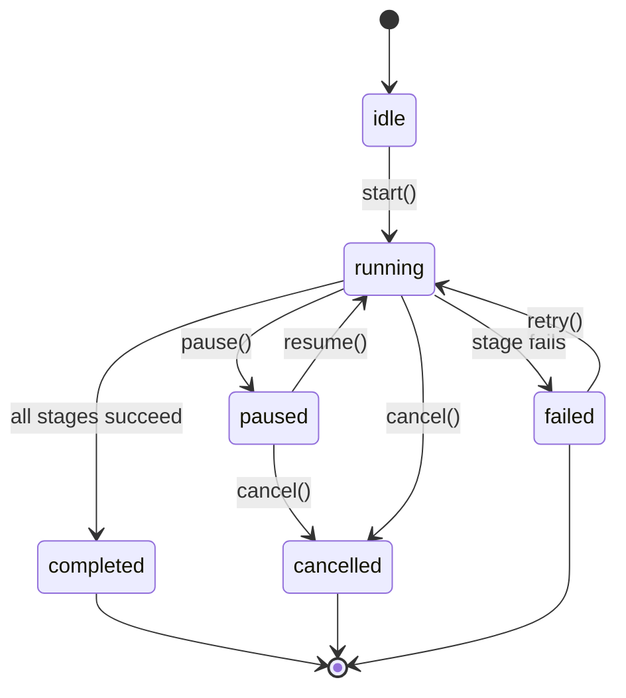

# Passthrough API Documentation

## Overview

The Passthrough API provides endpoints for managing automatic document generation pipelines. This API handles the automated creation of Design Documents, PRDs, and Prototypes after Q&A completion.

Base URL: `http://localhost:3001/api/tasks`

---

## Authentication

All endpoints require valid project context through task ID validation. The API ensures that Q&A sessions are completed before pipeline execution.

---

## Endpoints

### 1. Start Pipeline

Initiates a new passthrough pipeline or resumes from a specific stage.

**Endpoint:** `POST /api/tasks/:taskId/passthrough/start`

**Request Body:**

```typescript
{
  resumeFromStage?: 'design_doc' | 'prd' | 'prototype' | null
}
```

**Response (Success):**

```typescript
{
  success: true,
  data: {
    pipeline: {
      id: string,
      taskId: string,
      qaSessionId: string,
      status: 'pending' | 'running' | 'paused' | 'completed' | 'failed' | 'cancelled',
      currentStage: 'design_doc' | 'prd' | 'prototype' | null,
      stages: Array<{
        id: string,
        name: 'design_doc' | 'prd' | 'prototype',
        displayName: string,
        status: 'pending' | 'running' | 'completed' | 'failed' | 'cancelled',
        startedAt: string | null,
        completedAt: string | null,
        error: {
          message: string,
          code: string,
          stack?: string,
          retryCount?: number
        } | null,
        progress: number
      }>,
      createdAt: string,
      updatedAt: string,
      startedAt: string | null,
      completedAt: string | null
    },
    message: string
  }
}
```

**Error Responses:**

- `404` - Task not found
- `400` - Q&A not completed
- `409` - Pipeline already running
- `400` - Invalid stage specified

**Example:**

```bash
curl -X POST http://localhost:3001/api/tasks/task-123/passthrough/start \
  -H "Content-Type: application/json" \
  -d '{}'
```

---

### 2. Pause Pipeline

Pauses a currently running pipeline.

**Endpoint:** `POST /api/tasks/:taskId/passthrough/pause`

**Response (Success):**

```typescript
{
  success: true,
  data: {
    pipeline: PassthroughPipeline,
    message: 'Pipeline paused'
  }
}
```

**Error Responses:**

- `404` - Pipeline not found
- `405` - Operation not allowed for current status

**Example:**

```bash
curl -X POST http://localhost:3001/api/tasks/task-123/passthrough/pause
```

---

### 3. Resume Pipeline

Resumes a paused pipeline.

**Endpoint:** `POST /api/tasks/:taskId/passthrough/resume`

**Response (Success):**

```typescript
{
  success: true,
  data: {
    pipeline: PassthroughPipeline,
    message: 'Pipeline resumed'
  }
}
```

**Error Responses:**

- `404` - Pipeline not found
- `405` - Operation not allowed for current status

**Example:**

```bash
curl -X POST http://localhost:3001/api/tasks/task-123/passthrough/resume
```

---

### 4. Cancel Pipeline

Cancels a running or paused pipeline.

**Endpoint:** `POST /api/tasks/:taskId/passthrough/cancel`

**Response (Success):**

```typescript
{
  success: true,
  data: {
    pipeline: PassthroughPipeline,
    message: 'Pipeline cancelled'
  }
}
```

**Error Responses:**

- `404` - Pipeline not found
- `405` - Operation not allowed for current status

**Example:**

```bash
curl -X POST http://localhost:3001/api/tasks/task-123/passthrough/cancel
```

---

### 5. Get Pipeline Status

Retrieves the current status of a pipeline.

**Endpoint:** `GET /api/tasks/:taskId/passthrough/status`

**Response (Success):**

```typescript
{
  success: true,
  data: {
    pipeline: PassthroughPipeline
  }
}
```

**Error Responses:**

- `404` - Pipeline not found

**Example:**

```bash
curl http://localhost:3001/api/tasks/task-123/passthrough/status
```

---

### 6. Retry Stage

Retries a failed stage in the pipeline.

**Endpoint:** `POST /api/tasks/:taskId/passthrough/retry`

**Request Body:**

```typescript
{
  stage: 'design_doc' | 'prd' | 'prototype'
}
```

**Response (Success):**

```typescript
{
  success: true,
  data: {
    pipeline: PassthroughPipeline,
    message: 'Stage retry initiated'
  }
}
```

**Error Responses:**

- `400` - Missing stage parameter
- `400` - Invalid stage specified
- `404` - Pipeline not found
- `405` - Operation not allowed for current status

**Example:**

```bash
curl -X POST http://localhost:3001/api/tasks/task-123/passthrough/retry \
  -H "Content-Type: application/json" \
  -d '{"stage": "design_doc"}'
```

---

## Pipeline States

The pipeline follows these state transitions:



## Pipeline Stages

The pipeline executes the following stages in order:

1. **design_doc** - Generates the design document
2. **prd** - Generates the product requirements document
3. **prototype** - Generates the prototype code

Each stage includes:
- Status tracking (pending, running, completed, failed, cancelled)
- Progress percentage (0-100)
- Timestamps for start and completion
- Error information if failed

---

## Operation Rules

### Start Operation
- Allowed from: `idle`, `failed`, `completed` states
- Requires: Completed Q&A session
- Validates: No running pipeline exists

### Pause Operation
- Allowed from: `running` state only
- Effect: Current stage completes before pause

### Resume Operation
- Allowed from: `paused` state only
- Effect: Continues from next stage

### Cancel Operation
- Allowed from: `running`, `paused` states
- Effect: Immediate pipeline termination

### Retry Operation
- Allowed from: `failed` state only
- Effect: Resets failed stage and restarts pipeline

---

## Error Codes

| Code | Description |
|------|-------------|
| `TASK_NOT_FOUND` | Task does not exist |
| `PIPELINE_NOT_FOUND` | Pipeline does not exist |
| `PIPELINE_ALREADY_RUNNING` | Pipeline is already running |
| `QA_NOT_COMPLETED` | Q&A session not completed |
| `INVALID_PIPELINE_STAGE` | Invalid stage specified |
| `OPERATION_NOT_ALLOWED` | Operation not allowed for current status |
| `MISSING_REQUIRED_FIELD` | Required request field missing |

---

## Related Files

- Type definitions: `src/types/passthrough.ts`
- API routes: `server/routes/passthrough.ts`
- Storage: `server/utils/passthroughStorage.ts`
- Runner: `server/utils/passthroughRunner.ts`
- Client service: `src/services/passthroughService.ts`
- State management: `src/store/passthroughStore.ts`
