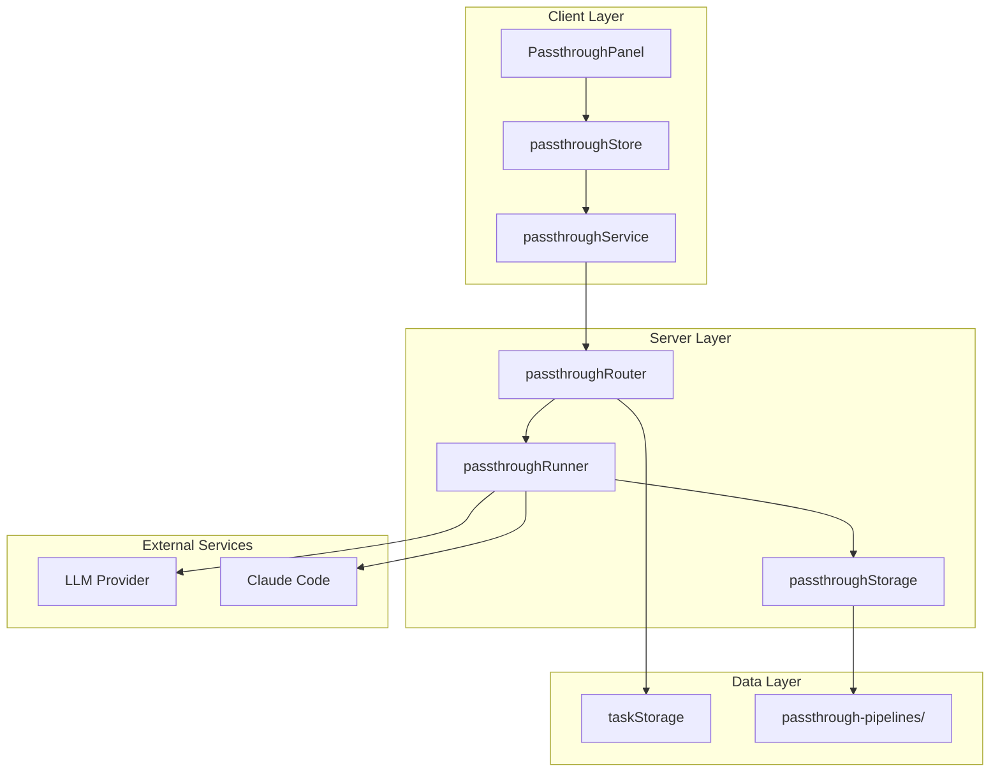
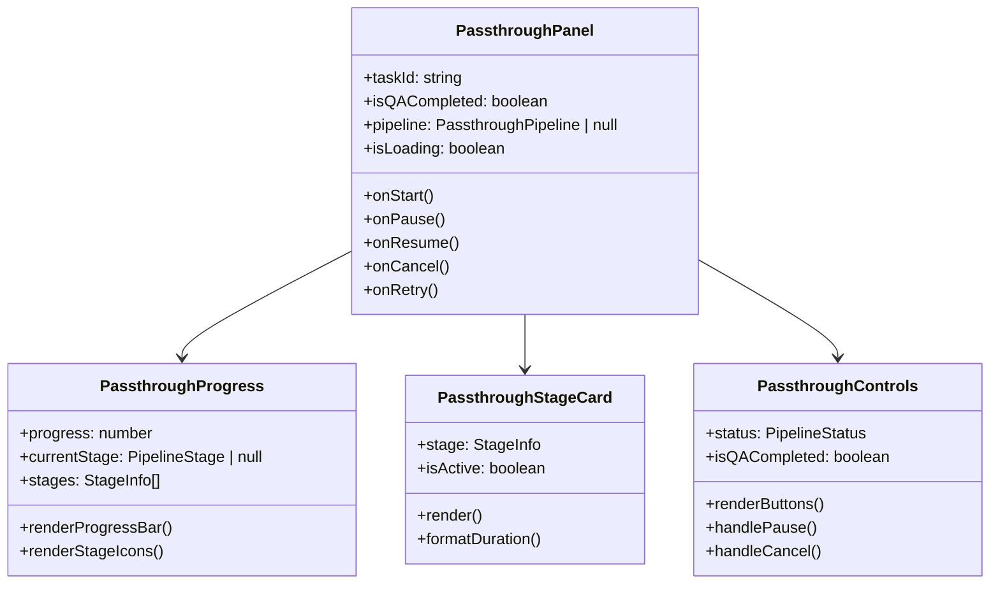
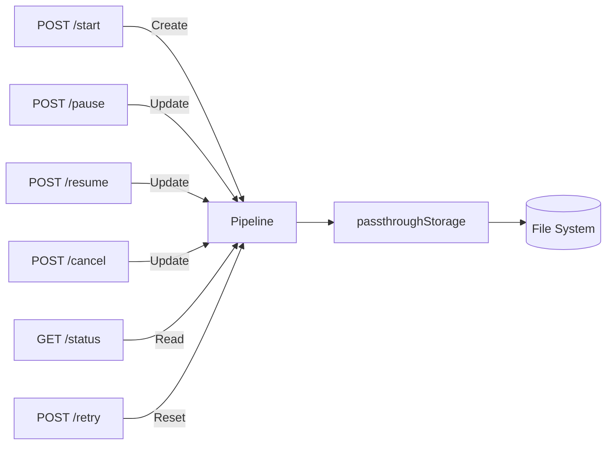
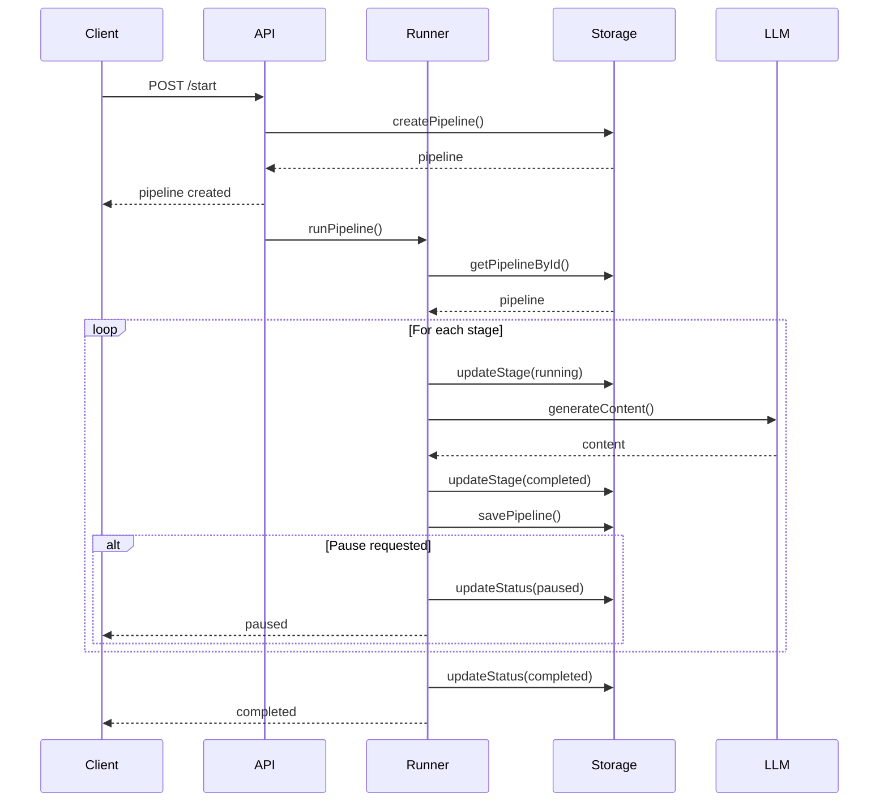
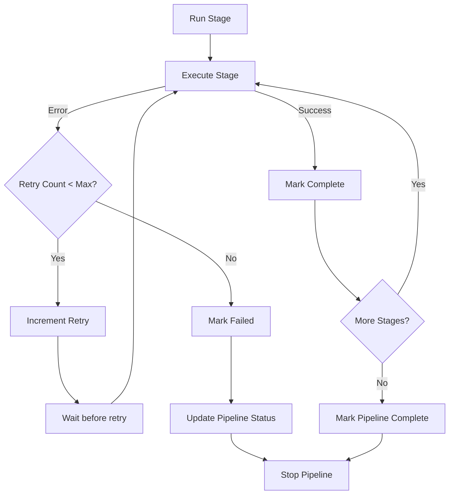
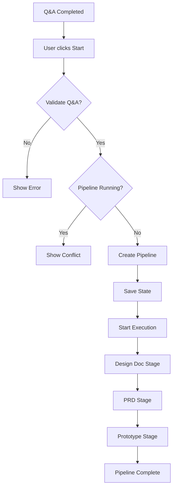
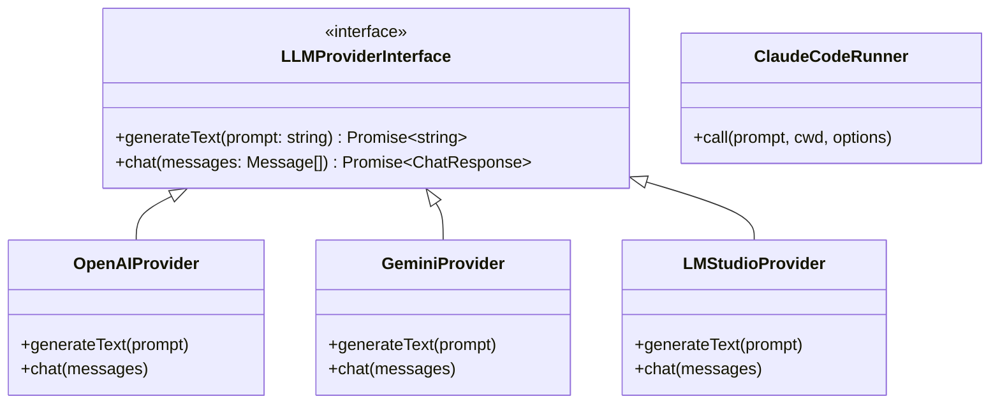
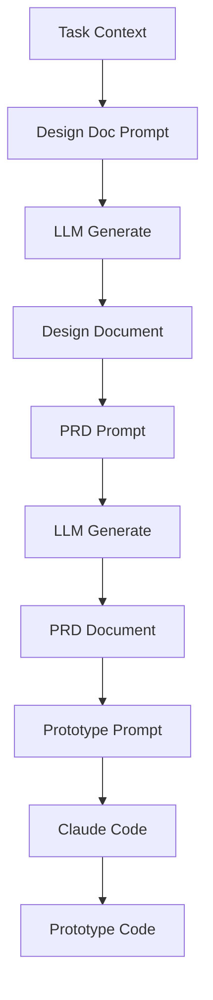

# Passthrough Architecture Documentation

## Overview

The Passthrough Automatic Pipeline is a distributed document generation system that automatically creates Design Documents, PRDs, and Prototypes after Q&A completion. The system provides real-time progress tracking, state persistence, and flexible control over the pipeline execution.

---

## System Architecture



---

## Component Architecture

### Client Layer

**PassthroughPanel Component**



**State Management (Zustand)**

```typescript
interface PassthroughStore {
  // State
  pipeline: PassthroughPipeline | null;
  isLoading: boolean;
  error: string | null;

  // Actions
  startPipeline: (taskId: string) => Promise<void>;
  pausePipeline: (taskId: string) => Promise<void>;
  resumePipeline: (taskId: string) => Promise<void>;
  cancelPipeline: (taskId: string) => Promise<void>;
  retryStage: (taskId: string, stage: PipelineStage) => Promise<void>;
  fetchPipelineStatus: (taskId: string) => Promise<void>;

  // Polling
  startPolling: (taskId: string) => void;
  stopPolling: () => void;
}
```

---

### Server Layer

**API Routes**



**Pipeline Execution Flow**



**Error Handling with Retry**



---

## Data Flow

### Pipeline Creation Flow



### State Persistence Flow

```mermaid
flowchart LR
    Memory[Pipeline State] --> Serialize[Serialize to JSON]
    Serialize --> Write[Write to File]
    Write --> File[task-{taskId}.json]
    Write --> File2[pipeline-{id}.json]

    File --> Read[Read on Recovery]
    File2 --> Read
    Read --> Deserialize[Deserialize JSON]
    Deserialize --> Restore[Restore State]
```

---

## Type System

### Core Types

```typescript
// Pipeline stage names
type PassthroughStageName = 'design_doc' | 'prd' | 'prototype';

// Stage status
type PassthroughStageStatus = 'pending' | 'running' | 'completed' | 'failed' | 'cancelled';

// Pipeline status
type PassthroughPipelineStatus = 'idle' | 'pending' | 'running' | 'paused' | 'completed' | 'failed' | 'cancelled';

// Stage information
interface PassthroughStage {
  id: string;
  name: PassthroughStageName;
  displayName: string;
  status: PassthroughStageStatus;
  startedAt: string | null;
  completedAt: string | null;
  error: PassthroughStageError | null;
  progress: number;
}

// Pipeline state
interface PassthroughPipeline {
  id: string;
  taskId: string;
  qaSessionId: string;
  status: PassthroughPipelineStatus;
  currentStage: PassthroughStageName | null;
  stages: PassthroughStage[];
  createdAt: string;
  updatedAt: string;
  startedAt: string | null;
  completedAt: string | null;
}
```

---

## Storage Architecture

### File System Structure

```
workspace/
  passthrough-pipelines/
    pipeline-{uuid}.json      # Primary storage by pipeline ID
    task-{taskId}.json         # Quick lookup by task ID
```

### Storage Operations

| Operation | Description | Files |
|-----------|-------------|-------|
| createPipeline | Create new pipeline | Both files |
| savePipeline | Update pipeline state | Both files |
| getPipelineById | Retrieve by pipeline ID | pipeline-{id}.json |
| getPipelineByTaskId | Retrieve by task ID | task-{taskId}.json |
| deletePipeline | Remove pipeline | Both files |
| listPipelines | List with filters | All pipeline files |

---

## LLM Integration

### LLM Provider Interface



### Prompt Building



---

## Performance Considerations

### Polling Strategy

- Client polls every 2 seconds for pipeline status
- Server responds with current pipeline state
- Polling stops when pipeline reaches terminal state

### State Persistence

- State saved after each stage completion
- Immediate save on pause/cancel operations
- Atomic file writes using fs.promises

### Timeout Handling

- Default stage timeout: 120 seconds
- Retry delay: 1 second
- Maximum retries: 3 attempts

---

## Security Considerations

### Input Validation

- Task ID validation before pipeline creation
- Stage name validation for retry operations
- Status validation for state transitions

### Operation Guards

- Q&A completion required before starting
- Duplicate pipeline prevention
- Operation-state compatibility checks

### Error Information

- Stack traces only in development
- Sanitized error messages for clients
- Detailed logging server-side

---

## Related Files

| Component | File Path |
|-----------|-----------|
| API Routes | `server/routes/passthrough.ts` |
| Pipeline Runner | `server/utils/passthroughRunner.ts` |
| Storage | `server/utils/passthroughStorage.ts` |
| Client Service | `src/services/passthroughService.ts` |
| State Store | `src/store/passthroughStore.ts` |
| Types | `src/types/passthrough.ts` |
| UI Components | `src/components/passthrough/` |
